This file documents the statistical analysis of dental microwear variables from Kenyan living human populations, as well as the code to produce Figure 1, the location map with fieldwork sites. A previous analyses of SSFA parameters (*Asfc*, *epLsar*, *HAsfc*, *Tfv*) was published in @correia2021. Here, ISO 25178 (or STA) parameters are also included in a multivariate analysis.


```r
#save images in folder in directory
knitr::opts_chunk$set(
  echo = TRUE, #shows code
  warning = FALSE, message = FALSE, #stops warning messages
  fig.path = "images/",
  dev = c("svg", "png", "tiff"), #saves figures as svg, tiff, and png in images folder
  dpi=300, #publishing quality
  tidy.opts=list(width.cutoff=60), # stops code from running off page
  tidy=TRUE
)
```


```r
# fileEnconding specifies character encoding as UTF-8
# rather than Unicode characters; otherwise unicode
# characters are added to column name
ISO <- read.csv("MW_ISO.csv", header = TRUE, sep = ",", stringsAsFactors = FALSE,
    fileEncoding = "UTF-8-BOM")

# making ggplot2 respect the Group order
ISO$Group <- factor(ISO$Group, levels = unique(ISO$Group))
ISO <- ISO |>
    mutate(Group = fct_relevel(Group, "El Molo", "Turkana", "Webuye",
        "Luhya", "Luo"))
levels(ISO$Group) <- c("El Molo", "Turkana", "Luhya (Webuye)",
    "Luhya (Port Vict.)", "Luo (Port Vict.)")

# fieldwork site location
sites <- read.csv("workplaces.txt")
```


```r
#graphical settings for map
map_theme <- theme(axis.text=element_blank(),
        axis.title=element_blank(),#and for axis titles
        panel.grid.minor = element_blank(), 
        panel.background = element_rect(fill="white"),
        plot.background = element_blank(),
        panel.grid.major = element_blank(),
        axis.ticks=element_blank(),  
        panel.border = element_rect(colour = "black", fill=NA, linewidth = 0.5))

#graphical settings for ggplot
my_theme <- theme(
  axis.text=element_text(size=8,colour="black"),
  axis.ticks=element_line (linewidth = 0.5, colour="black"), 
  axis.title=element_text(size=10),
  panel.grid.minor = element_blank(), 
  panel.background = element_blank(),
  panel.grid.major = element_blank(),
  legend.key=element_blank(),
  panel.border = element_rect(colour = "black", fill=NA, linewidth = 0.5))

#use first row data as column names for transposition
header.true <- function(df) {
  colnames(df) <- as.character(unlist(df[1,]))
  df[-1,]
}
```

# Producing the location map


```r
africa <- ne_countries(type = "countries", continent = "Africa",
    scale = "medium", returnclass = "sf")
lakes <- ne_download(scale = "medium", category = "physical",
    type = "lakes", returnclass = "sf")
```

```
## Reading layer `ne_50m_lakes' from data source 
##   `C:\Users\corre\AppData\Local\Temp\RtmpOMBK2X\ne_50m_lakes.shp' 
##   using driver `ESRI Shapefile'
## Simple feature collection with 412 features and 39 fields
## Geometry type: POLYGON
## Dimension:     XY
## Bounding box:  xmin: -165.8985 ymin: -50.62002 xmax: 176.0827 ymax: 81.94033
## Geodetic CRS:  WGS 84
```

```r
lakes <- ne_load(scale = "medium", category = "physical", type = "lakes",
    returnclass = "sf")
```

```
## Reading layer `ne_50m_lakes' from data source 
##   `C:\Users\corre\AppData\Local\Temp\RtmpOMBK2X\ne_50m_lakes.shp' 
##   using driver `ESRI Shapefile'
## Simple feature collection with 412 features and 39 fields
## Geometry type: POLYGON
## Dimension:     XY
## Bounding box:  xmin: -165.8985 ymin: -50.62002 xmax: 176.0827 ymax: 81.94033
## Geodetic CRS:  WGS 84
```

```r
# tomorrow start by trying to add lakes to map to do: inset
inset <- africa %>%
    ggplot() + geom_sf(fill = "grey87", color = "grey30") + geom_sf(data = africa |>
    filter(name %in% c("Kenya")), fill = "grey70", color = "grey30") +
    coord_sf(xlim = c(-22, 55), ylim = c(-40, 43), expand = FALSE) +
    geom_rect(aes(xmin = 31, xmax = 43, ymin = -5, ymax = 5.6),
        color = "black", fill = NA, linewidth = 0.6) + map_theme


main <- africa %>%
    ggplot() + geom_sf(fill = "grey87", color = "grey30") + geom_sf(data = africa |>
    filter(name %in% c("Kenya")), fill = "grey70", color = "grey30") +
    geom_sf(data = lakes, fill = "white") + geom_point(data = sites,
    aes(x = long, y = lat)) + coord_sf(xlim = c(31, 43), ylim = c(-5,
    5.6), expand = FALSE) + geom_sf_text(data = africa %>%
    filter(name %in% c("Kenya")), aes(label = name_long), size = 3.5,
    fontface = "bold", nudge_x = 0.6, nudge_y = 0.3) + geom_sf_text(data = lakes %>%
    filter(name %in% c("Lake Victoria", "Lake Turkana")), aes(label = c("Lake \n Victoria",
    "Lake \nTurkana")), size = 2.5, nudge_y = c(0.5, 0.1), nudge_x = c(0.1,
    1)) + ggrepel::geom_text_repel(data = sites, aes(x = long,
    y = lat, label = c("El Molo", "Luo | Luhya", "Luhya", "Turkana"),
    fontface = "plain"), nudge_y = c(-0.3, 0.05, 0.1, -0.5),
    nudge_x = c(0.3, 1, 0.2, 0.05), size = 2.9) + annotation_north_arrow(location = "tl",
    which_north = "true", height = unit(0.5, "cm"), width = unit(0.4,
        "cm"), pad_x = unit(0.4, "cm"), pad_y = unit(0.4, "cm")) +
    annotation_scale(location = "bl", style = "bar") + map_theme

# inset rectangle

main + annotation_custom(ggplotGrob(inset), xmin = 37.5, xmax = 44.5,
    ymin = 1.5, ymax = 5.5)
```

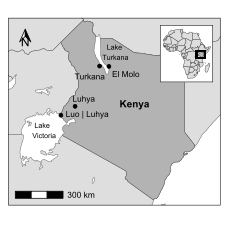<!-- -->

# Addressing collinearity

The STA parameters initially considered here are described in @iso/tc2132021:

1.  skewness (Ssk);
2.  maximum peak height (Sp);
3.  maximum height (Sz);
4.  extreme peak height (Sxp);
5.  root mean square gradient (Sdq);
6.  developed interfacial area ratio (Sdr);
7.  pit void volume (Vvv);
8.  five-point pit height (S5v);
9.  mean dale area (Sda);
10. mean dale volume (Sdv)

Some of the STA variables likely capture the same underlying variation. Thus, we expect some of the variables to be highly correlated [@ungar2019], which affects general linear models since it violates one of the main assumptions which states that dependent variables will be independent from each other, i.e. that there will be no multicollinearity [@field2012, p. 274]. Here, a [correlogram](http://www.sthda.com/english/wiki/visualize-correlation-matrix-using-correlogram) was used to evaluate the correlation matrix.


```r
dISO <- ISO %>%
    dplyr::select(Group, Asfc, epLsar, HAsfc, Tfv, Ssk, Sp, Sz,
        Sxp, Sdq, Sdr, Vvv, S5v, Sda, Sdv)

x <- as.matrix(dISO[, 2:15])
M <- x |>
    cor()

cor.mtest <- function(mat, ...) {
    mat <- as.matrix(mat)
    n <- ncol(mat)
    p.mat <- matrix(NA, n, n)
    diag(p.mat) <- 0
    for (i in 1:(n - 1)) {
        for (j in (i + 1):n) {
            tmp <- cor.test(mat[, i], mat[, j], ...)
            p.mat[i, j] <- p.mat[j, i] <- tmp$p.value
        }
    }
    colnames(p.mat) <- rownames(p.mat) <- colnames(mat)
    p.mat
}
# matrix of the p-value of the correlation
p.mat <- cor.mtest(x)

col <- colorRampPalette(c("#BB4444", "#EE9988", "#FFFFFF", "#77AADD",
    "#4477AA"))
corrplot(M, method = "color", col = col(200), type = "lower",
    tl.col = "black", addCoef.col = "black", p.mat = p.mat, sig.level = 0.01,
    insig = "blank", diag = FALSE)
```

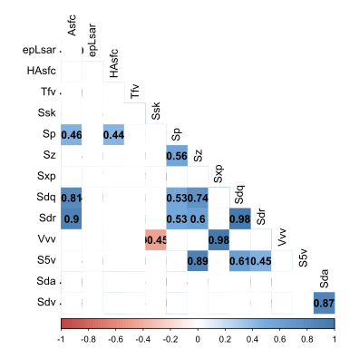<!-- -->

```r
# remove variables with high correlation
dISO <- dISO |>
    dplyr::select(-c(Sdr, Vvv, S5v))
```

Squares with colour are significant correlations ($p<0.01$) and we observed 3 correlations above 0.90, confirming collinearity. We removed 3 variables from the analyses to avoid this issue (*Sdr, Vvv, S5v*). In addition, we observe several medium to strong correlations, which suggest an underlying pattern of variation and support a multivariate approach.

# Visualization and descriptive statistics

Dotplots[^1] were used to visually examine the data, and it's interesting that there is one clear outlier for Sz, which explains the high standard deviation of this variable for the group including it. Descriptive statistics reported include standard and robust measures of both central tendency and dispersion (mean and SD; median and IQR).

[^1]: warning about bindiwdth but as binwidth depends on scale and each variable has different scales, setting binwidth produces graph with different sized dots; a possible solution wouldbe to use 'binwidth = unit(10, "npc")' as suggested here: <https://github.com/mjskay/ggdist/issues/53> but this gives error of !object is not coercible to a unit, which I think is related to recent changes to unit()?


```r
grouped.data <- dISO |>
    gather(key = "variable", value = "value", Asfc:Sdv) |>
    group_by(variable)

# Colour-blind palette
cbbPalette <- c("#E69F00", "#CC79A7", "#009E73", "#56B4E9", "#0072B2")

# dotplots
dotplot <- ggplot(grouped.data, aes(x = value, colour = Group,
    fill = Group)) + geom_dotplot(stackdir = "center", stackgroups = TRUE,
    binpositions = "all") + coord_flip() + scale_fill_manual(values = cbbPalette) +
    scale_colour_manual(values = cbbPalette) + scale_y_continuous(NULL,
    breaks = NULL) + facet_wrap(~variable, scales = "free_y") +
    my_theme

reposition_legend(dotplot, "center", panel = "panel-4-3")
```

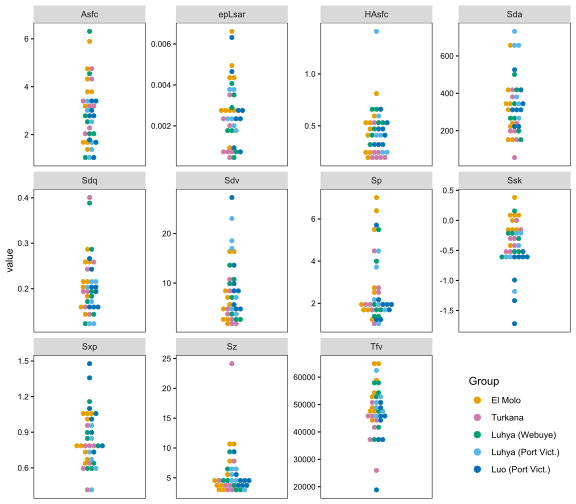<!-- -->

```r
# summary table
sISO <- dISO |>
    group_by(Group) |>
    get_summary_stats(type = "common", show = c("n", "mean",
        "sd", "median", "iqr"))

kbl(sISO, format = "html", booktabs = TRUE, longtable = TRUE,
    caption = "summary statistics") |>
    kable_classic(full_width = F, fixed_thead = T, bootstrap_options = c("hover",
        "responsive")) |>
    row_spec(0, italic = TRUE)
```

<table class=" lightable-classic" style='font-family: "Arial Narrow", "Source Sans Pro", sans-serif; width: auto !important; margin-left: auto; margin-right: auto;'>
<caption>summary statistics</caption>
 <thead>
  <tr>
   <th style="text-align:left;position: sticky; top:0; background-color: #FFFFFF;font-style: italic;"> Group </th>
   <th style="text-align:left;position: sticky; top:0; background-color: #FFFFFF;font-style: italic;"> variable </th>
   <th style="text-align:right;position: sticky; top:0; background-color: #FFFFFF;font-style: italic;"> n </th>
   <th style="text-align:right;position: sticky; top:0; background-color: #FFFFFF;font-style: italic;"> mean </th>
   <th style="text-align:right;position: sticky; top:0; background-color: #FFFFFF;font-style: italic;"> sd </th>
   <th style="text-align:right;position: sticky; top:0; background-color: #FFFFFF;font-style: italic;"> median </th>
   <th style="text-align:right;position: sticky; top:0; background-color: #FFFFFF;font-style: italic;"> iqr </th>
  </tr>
 </thead>
<tbody>
  <tr>
   <td style="text-align:left;"> El Molo </td>
   <td style="text-align:left;"> Asfc </td>
   <td style="text-align:right;"> 9 </td>
   <td style="text-align:right;"> 3.375 </td>
   <td style="text-align:right;"> 1.557 </td>
   <td style="text-align:right;"> 3.781 </td>
   <td style="text-align:right;"> 2.486 </td>
  </tr>
  <tr>
   <td style="text-align:left;"> El Molo </td>
   <td style="text-align:left;"> epLsar </td>
   <td style="text-align:right;"> 9 </td>
   <td style="text-align:right;"> 0.004 </td>
   <td style="text-align:right;"> 0.002 </td>
   <td style="text-align:right;"> 0.003 </td>
   <td style="text-align:right;"> 0.002 </td>
  </tr>
  <tr>
   <td style="text-align:left;"> El Molo </td>
   <td style="text-align:left;"> HAsfc </td>
   <td style="text-align:right;"> 9 </td>
   <td style="text-align:right;"> 0.451 </td>
   <td style="text-align:right;"> 0.196 </td>
   <td style="text-align:right;"> 0.460 </td>
   <td style="text-align:right;"> 0.280 </td>
  </tr>
  <tr>
   <td style="text-align:left;"> El Molo </td>
   <td style="text-align:left;"> Tfv </td>
   <td style="text-align:right;"> 9 </td>
   <td style="text-align:right;"> 53682.043 </td>
   <td style="text-align:right;"> 7781.755 </td>
   <td style="text-align:right;"> 52229.147 </td>
   <td style="text-align:right;"> 10723.046 </td>
  </tr>
  <tr>
   <td style="text-align:left;"> El Molo </td>
   <td style="text-align:left;"> Ssk </td>
   <td style="text-align:right;"> 9 </td>
   <td style="text-align:right;"> -0.034 </td>
   <td style="text-align:right;"> 0.229 </td>
   <td style="text-align:right;"> -0.028 </td>
   <td style="text-align:right;"> 0.211 </td>
  </tr>
  <tr>
   <td style="text-align:left;"> El Molo </td>
   <td style="text-align:left;"> Sp </td>
   <td style="text-align:right;"> 9 </td>
   <td style="text-align:right;"> 3.402 </td>
   <td style="text-align:right;"> 2.251 </td>
   <td style="text-align:right;"> 2.579 </td>
   <td style="text-align:right;"> 3.714 </td>
  </tr>
  <tr>
   <td style="text-align:left;"> El Molo </td>
   <td style="text-align:left;"> Sz </td>
   <td style="text-align:right;"> 9 </td>
   <td style="text-align:right;"> 5.875 </td>
   <td style="text-align:right;"> 3.157 </td>
   <td style="text-align:right;"> 4.667 </td>
   <td style="text-align:right;"> 4.549 </td>
  </tr>
  <tr>
   <td style="text-align:left;"> El Molo </td>
   <td style="text-align:left;"> Sxp </td>
   <td style="text-align:right;"> 9 </td>
   <td style="text-align:right;"> 0.862 </td>
   <td style="text-align:right;"> 0.173 </td>
   <td style="text-align:right;"> 0.795 </td>
   <td style="text-align:right;"> 0.309 </td>
  </tr>
  <tr>
   <td style="text-align:left;"> El Molo </td>
   <td style="text-align:left;"> Sdq </td>
   <td style="text-align:right;"> 9 </td>
   <td style="text-align:right;"> 0.214 </td>
   <td style="text-align:right;"> 0.046 </td>
   <td style="text-align:right;"> 0.214 </td>
   <td style="text-align:right;"> 0.067 </td>
  </tr>
  <tr>
   <td style="text-align:left;"> El Molo </td>
   <td style="text-align:left;"> Sda </td>
   <td style="text-align:right;"> 9 </td>
   <td style="text-align:right;"> 316.519 </td>
   <td style="text-align:right;"> 159.673 </td>
   <td style="text-align:right;"> 308.716 </td>
   <td style="text-align:right;"> 135.162 </td>
  </tr>
  <tr>
   <td style="text-align:left;"> El Molo </td>
   <td style="text-align:left;"> Sdv </td>
   <td style="text-align:right;"> 9 </td>
   <td style="text-align:right;"> 7.347 </td>
   <td style="text-align:right;"> 5.562 </td>
   <td style="text-align:right;"> 5.717 </td>
   <td style="text-align:right;"> 5.787 </td>
  </tr>
  <tr>
   <td style="text-align:left;"> Turkana </td>
   <td style="text-align:left;"> Asfc </td>
   <td style="text-align:right;"> 7 </td>
   <td style="text-align:right;"> 3.320 </td>
   <td style="text-align:right;"> 0.978 </td>
   <td style="text-align:right;"> 3.231 </td>
   <td style="text-align:right;"> 1.160 </td>
  </tr>
  <tr>
   <td style="text-align:left;"> Turkana </td>
   <td style="text-align:left;"> epLsar </td>
   <td style="text-align:right;"> 7 </td>
   <td style="text-align:right;"> 0.002 </td>
   <td style="text-align:right;"> 0.001 </td>
   <td style="text-align:right;"> 0.001 </td>
   <td style="text-align:right;"> 0.001 </td>
  </tr>
  <tr>
   <td style="text-align:left;"> Turkana </td>
   <td style="text-align:left;"> HAsfc </td>
   <td style="text-align:right;"> 7 </td>
   <td style="text-align:right;"> 0.256 </td>
   <td style="text-align:right;"> 0.124 </td>
   <td style="text-align:right;"> 0.210 </td>
   <td style="text-align:right;"> 0.055 </td>
  </tr>
  <tr>
   <td style="text-align:left;"> Turkana </td>
   <td style="text-align:left;"> Tfv </td>
   <td style="text-align:right;"> 7 </td>
   <td style="text-align:right;"> 41618.790 </td>
   <td style="text-align:right;"> 8024.451 </td>
   <td style="text-align:right;"> 44927.780 </td>
   <td style="text-align:right;"> 5903.392 </td>
  </tr>
  <tr>
   <td style="text-align:left;"> Turkana </td>
   <td style="text-align:left;"> Ssk </td>
   <td style="text-align:right;"> 7 </td>
   <td style="text-align:right;"> -0.315 </td>
   <td style="text-align:right;"> 0.199 </td>
   <td style="text-align:right;"> -0.336 </td>
   <td style="text-align:right;"> 0.249 </td>
  </tr>
  <tr>
   <td style="text-align:left;"> Turkana </td>
   <td style="text-align:left;"> Sp </td>
   <td style="text-align:right;"> 7 </td>
   <td style="text-align:right;"> 2.357 </td>
   <td style="text-align:right;"> 1.068 </td>
   <td style="text-align:right;"> 2.043 </td>
   <td style="text-align:right;"> 0.794 </td>
  </tr>
  <tr>
   <td style="text-align:left;"> Turkana </td>
   <td style="text-align:left;"> Sz </td>
   <td style="text-align:right;"> 7 </td>
   <td style="text-align:right;"> 7.159 </td>
   <td style="text-align:right;"> 7.644 </td>
   <td style="text-align:right;"> 3.772 </td>
   <td style="text-align:right;"> 2.754 </td>
  </tr>
  <tr>
   <td style="text-align:left;"> Turkana </td>
   <td style="text-align:left;"> Sxp </td>
   <td style="text-align:right;"> 7 </td>
   <td style="text-align:right;"> 0.713 </td>
   <td style="text-align:right;"> 0.173 </td>
   <td style="text-align:right;"> 0.769 </td>
   <td style="text-align:right;"> 0.159 </td>
  </tr>
  <tr>
   <td style="text-align:left;"> Turkana </td>
   <td style="text-align:left;"> Sdq </td>
   <td style="text-align:right;"> 7 </td>
   <td style="text-align:right;"> 0.229 </td>
   <td style="text-align:right;"> 0.086 </td>
   <td style="text-align:right;"> 0.198 </td>
   <td style="text-align:right;"> 0.073 </td>
  </tr>
  <tr>
   <td style="text-align:left;"> Turkana </td>
   <td style="text-align:left;"> Sda </td>
   <td style="text-align:right;"> 7 </td>
   <td style="text-align:right;"> 234.190 </td>
   <td style="text-align:right;"> 122.793 </td>
   <td style="text-align:right;"> 207.141 </td>
   <td style="text-align:right;"> 126.187 </td>
  </tr>
  <tr>
   <td style="text-align:left;"> Turkana </td>
   <td style="text-align:left;"> Sdv </td>
   <td style="text-align:right;"> 7 </td>
   <td style="text-align:right;"> 4.693 </td>
   <td style="text-align:right;"> 3.332 </td>
   <td style="text-align:right;"> 3.380 </td>
   <td style="text-align:right;"> 3.998 </td>
  </tr>
  <tr>
   <td style="text-align:left;"> Luhya (Webuye) </td>
   <td style="text-align:left;"> Asfc </td>
   <td style="text-align:right;"> 7 </td>
   <td style="text-align:right;"> 3.017 </td>
   <td style="text-align:right;"> 1.816 </td>
   <td style="text-align:right;"> 2.495 </td>
   <td style="text-align:right;"> 1.716 </td>
  </tr>
  <tr>
   <td style="text-align:left;"> Luhya (Webuye) </td>
   <td style="text-align:left;"> epLsar </td>
   <td style="text-align:right;"> 7 </td>
   <td style="text-align:right;"> 0.002 </td>
   <td style="text-align:right;"> 0.001 </td>
   <td style="text-align:right;"> 0.002 </td>
   <td style="text-align:right;"> 0.002 </td>
  </tr>
  <tr>
   <td style="text-align:left;"> Luhya (Webuye) </td>
   <td style="text-align:left;"> HAsfc </td>
   <td style="text-align:right;"> 7 </td>
   <td style="text-align:right;"> 0.504 </td>
   <td style="text-align:right;"> 0.126 </td>
   <td style="text-align:right;"> 0.520 </td>
   <td style="text-align:right;"> 0.155 </td>
  </tr>
  <tr>
   <td style="text-align:left;"> Luhya (Webuye) </td>
   <td style="text-align:left;"> Tfv </td>
   <td style="text-align:right;"> 7 </td>
   <td style="text-align:right;"> 49741.478 </td>
   <td style="text-align:right;"> 8327.653 </td>
   <td style="text-align:right;"> 53447.254 </td>
   <td style="text-align:right;"> 11367.517 </td>
  </tr>
  <tr>
   <td style="text-align:left;"> Luhya (Webuye) </td>
   <td style="text-align:left;"> Ssk </td>
   <td style="text-align:right;"> 7 </td>
   <td style="text-align:right;"> -0.303 </td>
   <td style="text-align:right;"> 0.260 </td>
   <td style="text-align:right;"> -0.277 </td>
   <td style="text-align:right;"> 0.325 </td>
  </tr>
  <tr>
   <td style="text-align:left;"> Luhya (Webuye) </td>
   <td style="text-align:left;"> Sp </td>
   <td style="text-align:right;"> 7 </td>
   <td style="text-align:right;"> 2.504 </td>
   <td style="text-align:right;"> 1.612 </td>
   <td style="text-align:right;"> 1.729 </td>
   <td style="text-align:right;"> 1.452 </td>
  </tr>
  <tr>
   <td style="text-align:left;"> Luhya (Webuye) </td>
   <td style="text-align:left;"> Sz </td>
   <td style="text-align:right;"> 7 </td>
   <td style="text-align:right;"> 4.815 </td>
   <td style="text-align:right;"> 2.244 </td>
   <td style="text-align:right;"> 4.223 </td>
   <td style="text-align:right;"> 2.237 </td>
  </tr>
  <tr>
   <td style="text-align:left;"> Luhya (Webuye) </td>
   <td style="text-align:left;"> Sxp </td>
   <td style="text-align:right;"> 7 </td>
   <td style="text-align:right;"> 0.790 </td>
   <td style="text-align:right;"> 0.204 </td>
   <td style="text-align:right;"> 0.792 </td>
   <td style="text-align:right;"> 0.256 </td>
  </tr>
  <tr>
   <td style="text-align:left;"> Luhya (Webuye) </td>
   <td style="text-align:left;"> Sdq </td>
   <td style="text-align:right;"> 7 </td>
   <td style="text-align:right;"> 0.212 </td>
   <td style="text-align:right;"> 0.095 </td>
   <td style="text-align:right;"> 0.179 </td>
   <td style="text-align:right;"> 0.084 </td>
  </tr>
  <tr>
   <td style="text-align:left;"> Luhya (Webuye) </td>
   <td style="text-align:left;"> Sda </td>
   <td style="text-align:right;"> 7 </td>
   <td style="text-align:right;"> 306.476 </td>
   <td style="text-align:right;"> 124.430 </td>
   <td style="text-align:right;"> 274.599 </td>
   <td style="text-align:right;"> 154.342 </td>
  </tr>
  <tr>
   <td style="text-align:left;"> Luhya (Webuye) </td>
   <td style="text-align:left;"> Sdv </td>
   <td style="text-align:right;"> 7 </td>
   <td style="text-align:right;"> 7.309 </td>
   <td style="text-align:right;"> 4.474 </td>
   <td style="text-align:right;"> 7.491 </td>
   <td style="text-align:right;"> 6.915 </td>
  </tr>
  <tr>
   <td style="text-align:left;"> Luhya (Port Vict.) </td>
   <td style="text-align:left;"> Asfc </td>
   <td style="text-align:right;"> 6 </td>
   <td style="text-align:right;"> 2.211 </td>
   <td style="text-align:right;"> 0.966 </td>
   <td style="text-align:right;"> 2.165 </td>
   <td style="text-align:right;"> 1.449 </td>
  </tr>
  <tr>
   <td style="text-align:left;"> Luhya (Port Vict.) </td>
   <td style="text-align:left;"> epLsar </td>
   <td style="text-align:right;"> 6 </td>
   <td style="text-align:right;"> 0.003 </td>
   <td style="text-align:right;"> 0.001 </td>
   <td style="text-align:right;"> 0.002 </td>
   <td style="text-align:right;"> 0.001 </td>
  </tr>
  <tr>
   <td style="text-align:left;"> Luhya (Port Vict.) </td>
   <td style="text-align:left;"> HAsfc </td>
   <td style="text-align:right;"> 6 </td>
   <td style="text-align:right;"> 0.557 </td>
   <td style="text-align:right;"> 0.437 </td>
   <td style="text-align:right;"> 0.430 </td>
   <td style="text-align:right;"> 0.248 </td>
  </tr>
  <tr>
   <td style="text-align:left;"> Luhya (Port Vict.) </td>
   <td style="text-align:left;"> Tfv </td>
   <td style="text-align:right;"> 6 </td>
   <td style="text-align:right;"> 51667.420 </td>
   <td style="text-align:right;"> 5782.717 </td>
   <td style="text-align:right;"> 50000.628 </td>
   <td style="text-align:right;"> 4299.156 </td>
  </tr>
  <tr>
   <td style="text-align:left;"> Luhya (Port Vict.) </td>
   <td style="text-align:left;"> Ssk </td>
   <td style="text-align:right;"> 6 </td>
   <td style="text-align:right;"> -0.543 </td>
   <td style="text-align:right;"> 0.353 </td>
   <td style="text-align:right;"> -0.491 </td>
   <td style="text-align:right;"> 0.326 </td>
  </tr>
  <tr>
   <td style="text-align:left;"> Luhya (Port Vict.) </td>
   <td style="text-align:left;"> Sp </td>
   <td style="text-align:right;"> 6 </td>
   <td style="text-align:right;"> 2.466 </td>
   <td style="text-align:right;"> 1.357 </td>
   <td style="text-align:right;"> 2.020 </td>
   <td style="text-align:right;"> 1.671 </td>
  </tr>
  <tr>
   <td style="text-align:left;"> Luhya (Port Vict.) </td>
   <td style="text-align:left;"> Sz </td>
   <td style="text-align:right;"> 6 </td>
   <td style="text-align:right;"> 5.025 </td>
   <td style="text-align:right;"> 1.458 </td>
   <td style="text-align:right;"> 5.084 </td>
   <td style="text-align:right;"> 1.588 </td>
  </tr>
  <tr>
   <td style="text-align:left;"> Luhya (Port Vict.) </td>
   <td style="text-align:left;"> Sxp </td>
   <td style="text-align:right;"> 6 </td>
   <td style="text-align:right;"> 0.697 </td>
   <td style="text-align:right;"> 0.192 </td>
   <td style="text-align:right;"> 0.697 </td>
   <td style="text-align:right;"> 0.214 </td>
  </tr>
  <tr>
   <td style="text-align:left;"> Luhya (Port Vict.) </td>
   <td style="text-align:left;"> Sdq </td>
   <td style="text-align:right;"> 6 </td>
   <td style="text-align:right;"> 0.175 </td>
   <td style="text-align:right;"> 0.043 </td>
   <td style="text-align:right;"> 0.189 </td>
   <td style="text-align:right;"> 0.073 </td>
  </tr>
  <tr>
   <td style="text-align:left;"> Luhya (Port Vict.) </td>
   <td style="text-align:left;"> Sda </td>
   <td style="text-align:right;"> 6 </td>
   <td style="text-align:right;"> 502.664 </td>
   <td style="text-align:right;"> 196.921 </td>
   <td style="text-align:right;"> 519.202 </td>
   <td style="text-align:right;"> 298.244 </td>
  </tr>
  <tr>
   <td style="text-align:left;"> Luhya (Port Vict.) </td>
   <td style="text-align:left;"> Sdv </td>
   <td style="text-align:right;"> 6 </td>
   <td style="text-align:right;"> 12.467 </td>
   <td style="text-align:right;"> 8.062 </td>
   <td style="text-align:right;"> 12.226 </td>
   <td style="text-align:right;"> 12.700 </td>
  </tr>
  <tr>
   <td style="text-align:left;"> Luo (Port Vict.) </td>
   <td style="text-align:left;"> Asfc </td>
   <td style="text-align:right;"> 8 </td>
   <td style="text-align:right;"> 2.474 </td>
   <td style="text-align:right;"> 0.859 </td>
   <td style="text-align:right;"> 2.748 </td>
   <td style="text-align:right;"> 1.304 </td>
  </tr>
  <tr>
   <td style="text-align:left;"> Luo (Port Vict.) </td>
   <td style="text-align:left;"> epLsar </td>
   <td style="text-align:right;"> 8 </td>
   <td style="text-align:right;"> 0.003 </td>
   <td style="text-align:right;"> 0.002 </td>
   <td style="text-align:right;"> 0.003 </td>
   <td style="text-align:right;"> 0.001 </td>
  </tr>
  <tr>
   <td style="text-align:left;"> Luo (Port Vict.) </td>
   <td style="text-align:left;"> HAsfc </td>
   <td style="text-align:right;"> 8 </td>
   <td style="text-align:right;"> 0.441 </td>
   <td style="text-align:right;"> 0.123 </td>
   <td style="text-align:right;"> 0.440 </td>
   <td style="text-align:right;"> 0.150 </td>
  </tr>
  <tr>
   <td style="text-align:left;"> Luo (Port Vict.) </td>
   <td style="text-align:left;"> Tfv </td>
   <td style="text-align:right;"> 8 </td>
   <td style="text-align:right;"> 41223.978 </td>
   <td style="text-align:right;"> 10192.177 </td>
   <td style="text-align:right;"> 45092.266 </td>
   <td style="text-align:right;"> 8974.235 </td>
  </tr>
  <tr>
   <td style="text-align:left;"> Luo (Port Vict.) </td>
   <td style="text-align:left;"> Ssk </td>
   <td style="text-align:right;"> 8 </td>
   <td style="text-align:right;"> -0.884 </td>
   <td style="text-align:right;"> 0.433 </td>
   <td style="text-align:right;"> -0.636 </td>
   <td style="text-align:right;"> 0.464 </td>
  </tr>
  <tr>
   <td style="text-align:left;"> Luo (Port Vict.) </td>
   <td style="text-align:left;"> Sp </td>
   <td style="text-align:right;"> 8 </td>
   <td style="text-align:right;"> 2.243 </td>
   <td style="text-align:right;"> 1.436 </td>
   <td style="text-align:right;"> 1.915 </td>
   <td style="text-align:right;"> 0.511 </td>
  </tr>
  <tr>
   <td style="text-align:left;"> Luo (Port Vict.) </td>
   <td style="text-align:left;"> Sz </td>
   <td style="text-align:right;"> 8 </td>
   <td style="text-align:right;"> 5.103 </td>
   <td style="text-align:right;"> 1.945 </td>
   <td style="text-align:right;"> 4.568 </td>
   <td style="text-align:right;"> 0.997 </td>
  </tr>
  <tr>
   <td style="text-align:left;"> Luo (Port Vict.) </td>
   <td style="text-align:left;"> Sxp </td>
   <td style="text-align:right;"> 8 </td>
   <td style="text-align:right;"> 1.055 </td>
   <td style="text-align:right;"> 0.259 </td>
   <td style="text-align:right;"> 1.043 </td>
   <td style="text-align:right;"> 0.300 </td>
  </tr>
  <tr>
   <td style="text-align:left;"> Luo (Port Vict.) </td>
   <td style="text-align:left;"> Sdq </td>
   <td style="text-align:right;"> 8 </td>
   <td style="text-align:right;"> 0.197 </td>
   <td style="text-align:right;"> 0.042 </td>
   <td style="text-align:right;"> 0.195 </td>
   <td style="text-align:right;"> 0.058 </td>
  </tr>
  <tr>
   <td style="text-align:left;"> Luo (Port Vict.) </td>
   <td style="text-align:left;"> Sda </td>
   <td style="text-align:right;"> 8 </td>
   <td style="text-align:right;"> 333.072 </td>
   <td style="text-align:right;"> 101.095 </td>
   <td style="text-align:right;"> 314.123 </td>
   <td style="text-align:right;"> 70.991 </td>
  </tr>
  <tr>
   <td style="text-align:left;"> Luo (Port Vict.) </td>
   <td style="text-align:left;"> Sdv </td>
   <td style="text-align:right;"> 8 </td>
   <td style="text-align:right;"> 10.347 </td>
   <td style="text-align:right;"> 7.417 </td>
   <td style="text-align:right;"> 8.368 </td>
   <td style="text-align:right;"> 5.473 </td>
  </tr>
</tbody>
</table>

# Inferential Statistics

A *multivariate analysis of variance* (MANOVA) was used to investigate variation in central tendency between groups, since it takes into consideration any relationship between the dependent variables.

## Assumptions

The assumptions of the MANOVA are [@field2012, p. 717]:

1.  Independence

2.  Random Sampling

3.  Uni and multivariate normality (within groups)

4.  Uni and multivariate homogeneity of variances

5.  Linearity (linear relationships among all pairs of dependent variables, all pairs of covariates, and all dependent variable-covariate pairs in each cell)

    ADDITIONAL LIMITATIONS

6.  Unequal sample sizes (when cells in a factorial MANOVA have different sample sizes, the sum of squares for effect plus error does not equal the total sum of squares. This causes tests of main effects and interactions to be correlated)

7.  Uni and multivariate outliers (may produce either a Type I or Type II error and give no indication as to which type of error is occurring in the analysis)

**Independence** and **linearity** were addressed with the correlogram. **Sample sizes** are not too unequal, but small. Specifically, the sample size of each group is inferior to the number of variables, which is a risk when conducting multivariate analyses. Next, we will examine the outliers, normality and homocedasticity of the data. Conducting multiple statistical tests increases the chances of Type I error; when necessary, we applied a false discovery rate (FDR) correction, also known as Benjamini & Hochberg.

The `aq.plot()` function from the `mvoutlier` package [@filzmoser] identifies **multivariate outliers** by plotting the ordered squared robust Mahalanobis distances of the observations against the empirical distribution function of the MD2i. The function produces 4 graphs that identify multivariate outliers in red. Univariate outliers were identified in the graphs above.


```r
outliers <- aq.plot(dISO[, 2:12])
```

```
## Projection to the first and second robust principal components.
## Proportion of total variation (explained variance): 0.9994354
```

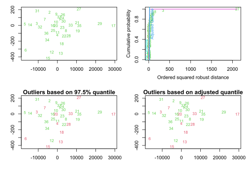<!-- -->

To test for **multivariate normality** within groups, we used the `mshapiro.test` in the `mvnormtest` package [@jarek2012], which suggests that there is no multivariate normality. We also assessed multinormality graphically by examining plots of the ordered Mahalanobis distances (D^2^) and paired chi-squared values, $\chi$ ^2^, of the model residuals. If the data are multivariate normal, the plot should form a relatively straight, diagonal line. The lack of multivariate normality is not surprising considering that the scales of measurement are very distinct between variables.


```r
# Perform the multivariate Shapiro-Wilk test within each
# group
mshapiro_results <- dISO %>%
    group_by(Group) %>%
    do(tidy(mvnormtest::mshapiro.test(as.matrix(select(., where(is.numeric))))))


kbl(mshapiro_results, digits = c(0, 3, 10), format = "html",
    booktabs = TRUE, caption = "Multinormality tests") |>
    kable_classic(full_width = F, fixed_thead = T, bootstrap_options = c("hover",
        "responsive")) |>
    row_spec(0, italic = TRUE)
```

<table class=" lightable-classic" style='font-family: "Arial Narrow", "Source Sans Pro", sans-serif; width: auto !important; margin-left: auto; margin-right: auto;'>
<caption>Multinormality tests</caption>
 <thead>
  <tr>
   <th style="text-align:left;position: sticky; top:0; background-color: #FFFFFF;font-style: italic;"> Group </th>
   <th style="text-align:right;position: sticky; top:0; background-color: #FFFFFF;font-style: italic;"> statistic </th>
   <th style="text-align:right;position: sticky; top:0; background-color: #FFFFFF;font-style: italic;"> p.value </th>
   <th style="text-align:left;position: sticky; top:0; background-color: #FFFFFF;font-style: italic;"> method </th>
  </tr>
 </thead>
<tbody>
  <tr>
   <td style="text-align:left;"> El Molo </td>
   <td style="text-align:right;"> 0.345 </td>
   <td style="text-align:right;"> 2.25e-08 </td>
   <td style="text-align:left;"> Shapiro-Wilk normality test </td>
  </tr>
  <tr>
   <td style="text-align:left;"> Turkana </td>
   <td style="text-align:right;"> 0.345 </td>
   <td style="text-align:right;"> 2.24e-08 </td>
   <td style="text-align:left;"> Shapiro-Wilk normality test </td>
  </tr>
  <tr>
   <td style="text-align:left;"> Luhya (Webuye) </td>
   <td style="text-align:right;"> 0.347 </td>
   <td style="text-align:right;"> 2.34e-08 </td>
   <td style="text-align:left;"> Shapiro-Wilk normality test </td>
  </tr>
  <tr>
   <td style="text-align:left;"> Luhya (Port Vict.) </td>
   <td style="text-align:right;"> 0.345 </td>
   <td style="text-align:right;"> 2.25e-08 </td>
   <td style="text-align:left;"> Shapiro-Wilk normality test </td>
  </tr>
  <tr>
   <td style="text-align:left;"> Luo (Port Vict.) </td>
   <td style="text-align:right;"> 0.345 </td>
   <td style="text-align:right;"> 2.24e-08 </td>
   <td style="text-align:left;"> Shapiro-Wilk normality test </td>
  </tr>
</tbody>
</table>

```r
cqplot(lm(as.matrix(dISO[, 2:12]) ~ Group, data = dISO), main = "Chi-Square Q-Q Plot of MANOVA Model Residuals")
```

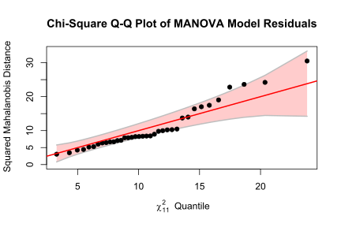<!-- -->

For **univariate normality**, we used `shapiro.test`, and found 4 significant tests at `p<0.01`, suggesting most variables are normal within groups.


```r
uni_normal <- grouped.data |>
    group_by(variable, Group) |>
    do(tidy(shapiro.test(.$value)))

color.me <- which(uni_normal$p.value < 0.01)

kbl(uni_normal, digits = c(3, 3), format = "html", booktabs = TRUE,
    longtable = TRUE, caption = "Uninormality tests") |>
    kable_classic(full_width = F, fixed_thead = T, bootstrap_options = c("hover",
        "responsive")) |>
    row_spec(color.me, bold = TRUE, background = "gray!6") |>
    row_spec(0, italic = TRUE)
```

<table class=" lightable-classic" style='font-family: "Arial Narrow", "Source Sans Pro", sans-serif; width: auto !important; margin-left: auto; margin-right: auto;'>
<caption>Uninormality tests</caption>
 <thead>
  <tr>
   <th style="text-align:left;position: sticky; top:0; background-color: #FFFFFF;font-style: italic;"> variable </th>
   <th style="text-align:left;position: sticky; top:0; background-color: #FFFFFF;font-style: italic;"> Group </th>
   <th style="text-align:right;position: sticky; top:0; background-color: #FFFFFF;font-style: italic;"> statistic </th>
   <th style="text-align:right;position: sticky; top:0; background-color: #FFFFFF;font-style: italic;"> p.value </th>
   <th style="text-align:left;position: sticky; top:0; background-color: #FFFFFF;font-style: italic;"> method </th>
  </tr>
 </thead>
<tbody>
  <tr>
   <td style="text-align:left;"> Asfc </td>
   <td style="text-align:left;"> El Molo </td>
   <td style="text-align:right;"> 0.938 </td>
   <td style="text-align:right;"> 0.562 </td>
   <td style="text-align:left;"> Shapiro-Wilk normality test </td>
  </tr>
  <tr>
   <td style="text-align:left;"> Asfc </td>
   <td style="text-align:left;"> Turkana </td>
   <td style="text-align:right;"> 0.926 </td>
   <td style="text-align:right;"> 0.520 </td>
   <td style="text-align:left;"> Shapiro-Wilk normality test </td>
  </tr>
  <tr>
   <td style="text-align:left;"> Asfc </td>
   <td style="text-align:left;"> Luhya (Webuye) </td>
   <td style="text-align:right;"> 0.902 </td>
   <td style="text-align:right;"> 0.340 </td>
   <td style="text-align:left;"> Shapiro-Wilk normality test </td>
  </tr>
  <tr>
   <td style="text-align:left;"> Asfc </td>
   <td style="text-align:left;"> Luhya (Port Vict.) </td>
   <td style="text-align:right;"> 0.944 </td>
   <td style="text-align:right;"> 0.694 </td>
   <td style="text-align:left;"> Shapiro-Wilk normality test </td>
  </tr>
  <tr>
   <td style="text-align:left;"> Asfc </td>
   <td style="text-align:left;"> Luo (Port Vict.) </td>
   <td style="text-align:right;"> 0.910 </td>
   <td style="text-align:right;"> 0.355 </td>
   <td style="text-align:left;"> Shapiro-Wilk normality test </td>
  </tr>
  <tr>
   <td style="text-align:left;"> HAsfc </td>
   <td style="text-align:left;"> El Molo </td>
   <td style="text-align:right;"> 0.951 </td>
   <td style="text-align:right;"> 0.705 </td>
   <td style="text-align:left;"> Shapiro-Wilk normality test </td>
  </tr>
  <tr>
   <td style="text-align:left;font-weight: bold;background-color: gray!6 !important;"> HAsfc </td>
   <td style="text-align:left;font-weight: bold;background-color: gray!6 !important;"> Turkana </td>
   <td style="text-align:right;font-weight: bold;background-color: gray!6 !important;"> 0.650 </td>
   <td style="text-align:right;font-weight: bold;background-color: gray!6 !important;"> 0.001 </td>
   <td style="text-align:left;font-weight: bold;background-color: gray!6 !important;"> Shapiro-Wilk normality test </td>
  </tr>
  <tr>
   <td style="text-align:left;"> HAsfc </td>
   <td style="text-align:left;"> Luhya (Webuye) </td>
   <td style="text-align:right;"> 0.935 </td>
   <td style="text-align:right;"> 0.595 </td>
   <td style="text-align:left;"> Shapiro-Wilk normality test </td>
  </tr>
  <tr>
   <td style="text-align:left;"> HAsfc </td>
   <td style="text-align:left;"> Luhya (Port Vict.) </td>
   <td style="text-align:right;"> 0.747 </td>
   <td style="text-align:right;"> 0.019 </td>
   <td style="text-align:left;"> Shapiro-Wilk normality test </td>
  </tr>
  <tr>
   <td style="text-align:left;"> HAsfc </td>
   <td style="text-align:left;"> Luo (Port Vict.) </td>
   <td style="text-align:right;"> 0.935 </td>
   <td style="text-align:right;"> 0.567 </td>
   <td style="text-align:left;"> Shapiro-Wilk normality test </td>
  </tr>
  <tr>
   <td style="text-align:left;"> Sda </td>
   <td style="text-align:left;"> El Molo </td>
   <td style="text-align:right;"> 0.893 </td>
   <td style="text-align:right;"> 0.217 </td>
   <td style="text-align:left;"> Shapiro-Wilk normality test </td>
  </tr>
  <tr>
   <td style="text-align:left;"> Sda </td>
   <td style="text-align:left;"> Turkana </td>
   <td style="text-align:right;"> 0.947 </td>
   <td style="text-align:right;"> 0.701 </td>
   <td style="text-align:left;"> Shapiro-Wilk normality test </td>
  </tr>
  <tr>
   <td style="text-align:left;"> Sda </td>
   <td style="text-align:left;"> Luhya (Webuye) </td>
   <td style="text-align:right;"> 0.968 </td>
   <td style="text-align:right;"> 0.881 </td>
   <td style="text-align:left;"> Shapiro-Wilk normality test </td>
  </tr>
  <tr>
   <td style="text-align:left;"> Sda </td>
   <td style="text-align:left;"> Luhya (Port Vict.) </td>
   <td style="text-align:right;"> 0.882 </td>
   <td style="text-align:right;"> 0.279 </td>
   <td style="text-align:left;"> Shapiro-Wilk normality test </td>
  </tr>
  <tr>
   <td style="text-align:left;"> Sda </td>
   <td style="text-align:left;"> Luo (Port Vict.) </td>
   <td style="text-align:right;"> 0.916 </td>
   <td style="text-align:right;"> 0.401 </td>
   <td style="text-align:left;"> Shapiro-Wilk normality test </td>
  </tr>
  <tr>
   <td style="text-align:left;"> Sdq </td>
   <td style="text-align:left;"> El Molo </td>
   <td style="text-align:right;"> 0.976 </td>
   <td style="text-align:right;"> 0.937 </td>
   <td style="text-align:left;"> Shapiro-Wilk normality test </td>
  </tr>
  <tr>
   <td style="text-align:left;"> Sdq </td>
   <td style="text-align:left;"> Turkana </td>
   <td style="text-align:right;"> 0.864 </td>
   <td style="text-align:right;"> 0.163 </td>
   <td style="text-align:left;"> Shapiro-Wilk normality test </td>
  </tr>
  <tr>
   <td style="text-align:left;"> Sdq </td>
   <td style="text-align:left;"> Luhya (Webuye) </td>
   <td style="text-align:right;"> 0.850 </td>
   <td style="text-align:right;"> 0.122 </td>
   <td style="text-align:left;"> Shapiro-Wilk normality test </td>
  </tr>
  <tr>
   <td style="text-align:left;"> Sdq </td>
   <td style="text-align:left;"> Luhya (Port Vict.) </td>
   <td style="text-align:right;"> 0.821 </td>
   <td style="text-align:right;"> 0.090 </td>
   <td style="text-align:left;"> Shapiro-Wilk normality test </td>
  </tr>
  <tr>
   <td style="text-align:left;"> Sdq </td>
   <td style="text-align:left;"> Luo (Port Vict.) </td>
   <td style="text-align:right;"> 0.896 </td>
   <td style="text-align:right;"> 0.264 </td>
   <td style="text-align:left;"> Shapiro-Wilk normality test </td>
  </tr>
  <tr>
   <td style="text-align:left;"> Sdv </td>
   <td style="text-align:left;"> El Molo </td>
   <td style="text-align:right;"> 0.854 </td>
   <td style="text-align:right;"> 0.082 </td>
   <td style="text-align:left;"> Shapiro-Wilk normality test </td>
  </tr>
  <tr>
   <td style="text-align:left;"> Sdv </td>
   <td style="text-align:left;"> Turkana </td>
   <td style="text-align:right;"> 0.830 </td>
   <td style="text-align:right;"> 0.080 </td>
   <td style="text-align:left;"> Shapiro-Wilk normality test </td>
  </tr>
  <tr>
   <td style="text-align:left;"> Sdv </td>
   <td style="text-align:left;"> Luhya (Webuye) </td>
   <td style="text-align:right;"> 0.925 </td>
   <td style="text-align:right;"> 0.513 </td>
   <td style="text-align:left;"> Shapiro-Wilk normality test </td>
  </tr>
  <tr>
   <td style="text-align:left;"> Sdv </td>
   <td style="text-align:left;"> Luhya (Port Vict.) </td>
   <td style="text-align:right;"> 0.884 </td>
   <td style="text-align:right;"> 0.288 </td>
   <td style="text-align:left;"> Shapiro-Wilk normality test </td>
  </tr>
  <tr>
   <td style="text-align:left;"> Sdv </td>
   <td style="text-align:left;"> Luo (Port Vict.) </td>
   <td style="text-align:right;"> 0.760 </td>
   <td style="text-align:right;"> 0.011 </td>
   <td style="text-align:left;"> Shapiro-Wilk normality test </td>
  </tr>
  <tr>
   <td style="text-align:left;"> Sp </td>
   <td style="text-align:left;"> El Molo </td>
   <td style="text-align:right;"> 0.832 </td>
   <td style="text-align:right;"> 0.047 </td>
   <td style="text-align:left;"> Shapiro-Wilk normality test </td>
  </tr>
  <tr>
   <td style="text-align:left;"> Sp </td>
   <td style="text-align:left;"> Turkana </td>
   <td style="text-align:right;"> 0.888 </td>
   <td style="text-align:right;"> 0.264 </td>
   <td style="text-align:left;"> Shapiro-Wilk normality test </td>
  </tr>
  <tr>
   <td style="text-align:left;"> Sp </td>
   <td style="text-align:left;"> Luhya (Webuye) </td>
   <td style="text-align:right;"> 0.748 </td>
   <td style="text-align:right;"> 0.012 </td>
   <td style="text-align:left;"> Shapiro-Wilk normality test </td>
  </tr>
  <tr>
   <td style="text-align:left;"> Sp </td>
   <td style="text-align:left;"> Luhya (Port Vict.) </td>
   <td style="text-align:right;"> 0.919 </td>
   <td style="text-align:right;"> 0.496 </td>
   <td style="text-align:left;"> Shapiro-Wilk normality test </td>
  </tr>
  <tr>
   <td style="text-align:left;font-weight: bold;background-color: gray!6 !important;"> Sp </td>
   <td style="text-align:left;font-weight: bold;background-color: gray!6 !important;"> Luo (Port Vict.) </td>
   <td style="text-align:right;font-weight: bold;background-color: gray!6 !important;"> 0.626 </td>
   <td style="text-align:right;font-weight: bold;background-color: gray!6 !important;"> 0.000 </td>
   <td style="text-align:left;font-weight: bold;background-color: gray!6 !important;"> Shapiro-Wilk normality test </td>
  </tr>
  <tr>
   <td style="text-align:left;"> Ssk </td>
   <td style="text-align:left;"> El Molo </td>
   <td style="text-align:right;"> 0.965 </td>
   <td style="text-align:right;"> 0.849 </td>
   <td style="text-align:left;"> Shapiro-Wilk normality test </td>
  </tr>
  <tr>
   <td style="text-align:left;"> Ssk </td>
   <td style="text-align:left;"> Turkana </td>
   <td style="text-align:right;"> 0.944 </td>
   <td style="text-align:right;"> 0.674 </td>
   <td style="text-align:left;"> Shapiro-Wilk normality test </td>
  </tr>
  <tr>
   <td style="text-align:left;"> Ssk </td>
   <td style="text-align:left;"> Luhya (Webuye) </td>
   <td style="text-align:right;"> 0.909 </td>
   <td style="text-align:right;"> 0.386 </td>
   <td style="text-align:left;"> Shapiro-Wilk normality test </td>
  </tr>
  <tr>
   <td style="text-align:left;"> Ssk </td>
   <td style="text-align:left;"> Luhya (Port Vict.) </td>
   <td style="text-align:right;"> 0.860 </td>
   <td style="text-align:right;"> 0.188 </td>
   <td style="text-align:left;"> Shapiro-Wilk normality test </td>
  </tr>
  <tr>
   <td style="text-align:left;"> Ssk </td>
   <td style="text-align:left;"> Luo (Port Vict.) </td>
   <td style="text-align:right;"> 0.785 </td>
   <td style="text-align:right;"> 0.020 </td>
   <td style="text-align:left;"> Shapiro-Wilk normality test </td>
  </tr>
  <tr>
   <td style="text-align:left;"> Sxp </td>
   <td style="text-align:left;"> El Molo </td>
   <td style="text-align:right;"> 0.848 </td>
   <td style="text-align:right;"> 0.071 </td>
   <td style="text-align:left;"> Shapiro-Wilk normality test </td>
  </tr>
  <tr>
   <td style="text-align:left;"> Sxp </td>
   <td style="text-align:left;"> Turkana </td>
   <td style="text-align:right;"> 0.969 </td>
   <td style="text-align:right;"> 0.887 </td>
   <td style="text-align:left;"> Shapiro-Wilk normality test </td>
  </tr>
  <tr>
   <td style="text-align:left;"> Sxp </td>
   <td style="text-align:left;"> Luhya (Webuye) </td>
   <td style="text-align:right;"> 0.903 </td>
   <td style="text-align:right;"> 0.350 </td>
   <td style="text-align:left;"> Shapiro-Wilk normality test </td>
  </tr>
  <tr>
   <td style="text-align:left;"> Sxp </td>
   <td style="text-align:left;"> Luhya (Port Vict.) </td>
   <td style="text-align:right;"> 0.985 </td>
   <td style="text-align:right;"> 0.974 </td>
   <td style="text-align:left;"> Shapiro-Wilk normality test </td>
  </tr>
  <tr>
   <td style="text-align:left;"> Sxp </td>
   <td style="text-align:left;"> Luo (Port Vict.) </td>
   <td style="text-align:right;"> 0.942 </td>
   <td style="text-align:right;"> 0.628 </td>
   <td style="text-align:left;"> Shapiro-Wilk normality test </td>
  </tr>
  <tr>
   <td style="text-align:left;"> Sz </td>
   <td style="text-align:left;"> El Molo </td>
   <td style="text-align:right;"> 0.850 </td>
   <td style="text-align:right;"> 0.074 </td>
   <td style="text-align:left;"> Shapiro-Wilk normality test </td>
  </tr>
  <tr>
   <td style="text-align:left;font-weight: bold;background-color: gray!6 !important;"> Sz </td>
   <td style="text-align:left;font-weight: bold;background-color: gray!6 !important;"> Turkana </td>
   <td style="text-align:right;font-weight: bold;background-color: gray!6 !important;"> 0.608 </td>
   <td style="text-align:right;font-weight: bold;background-color: gray!6 !important;"> 0.000 </td>
   <td style="text-align:left;font-weight: bold;background-color: gray!6 !important;"> Shapiro-Wilk normality test </td>
  </tr>
  <tr>
   <td style="text-align:left;"> Sz </td>
   <td style="text-align:left;"> Luhya (Webuye) </td>
   <td style="text-align:right;"> 0.822 </td>
   <td style="text-align:right;"> 0.067 </td>
   <td style="text-align:left;"> Shapiro-Wilk normality test </td>
  </tr>
  <tr>
   <td style="text-align:left;"> Sz </td>
   <td style="text-align:left;"> Luhya (Port Vict.) </td>
   <td style="text-align:right;"> 0.941 </td>
   <td style="text-align:right;"> 0.670 </td>
   <td style="text-align:left;"> Shapiro-Wilk normality test </td>
  </tr>
  <tr>
   <td style="text-align:left;font-weight: bold;background-color: gray!6 !important;"> Sz </td>
   <td style="text-align:left;font-weight: bold;background-color: gray!6 !important;"> Luo (Port Vict.) </td>
   <td style="text-align:right;font-weight: bold;background-color: gray!6 !important;"> 0.688 </td>
   <td style="text-align:right;font-weight: bold;background-color: gray!6 !important;"> 0.002 </td>
   <td style="text-align:left;font-weight: bold;background-color: gray!6 !important;"> Shapiro-Wilk normality test </td>
  </tr>
  <tr>
   <td style="text-align:left;"> Tfv </td>
   <td style="text-align:left;"> El Molo </td>
   <td style="text-align:right;"> 0.920 </td>
   <td style="text-align:right;"> 0.388 </td>
   <td style="text-align:left;"> Shapiro-Wilk normality test </td>
  </tr>
  <tr>
   <td style="text-align:left;"> Tfv </td>
   <td style="text-align:left;"> Turkana </td>
   <td style="text-align:right;"> 0.871 </td>
   <td style="text-align:right;"> 0.188 </td>
   <td style="text-align:left;"> Shapiro-Wilk normality test </td>
  </tr>
  <tr>
   <td style="text-align:left;"> Tfv </td>
   <td style="text-align:left;"> Luhya (Webuye) </td>
   <td style="text-align:right;"> 0.912 </td>
   <td style="text-align:right;"> 0.408 </td>
   <td style="text-align:left;"> Shapiro-Wilk normality test </td>
  </tr>
  <tr>
   <td style="text-align:left;"> Tfv </td>
   <td style="text-align:left;"> Luhya (Port Vict.) </td>
   <td style="text-align:right;"> 0.851 </td>
   <td style="text-align:right;"> 0.161 </td>
   <td style="text-align:left;"> Shapiro-Wilk normality test </td>
  </tr>
  <tr>
   <td style="text-align:left;"> Tfv </td>
   <td style="text-align:left;"> Luo (Port Vict.) </td>
   <td style="text-align:right;"> 0.814 </td>
   <td style="text-align:right;"> 0.040 </td>
   <td style="text-align:left;"> Shapiro-Wilk normality test </td>
  </tr>
  <tr>
   <td style="text-align:left;"> epLsar </td>
   <td style="text-align:left;"> El Molo </td>
   <td style="text-align:right;"> 0.942 </td>
   <td style="text-align:right;"> 0.608 </td>
   <td style="text-align:left;"> Shapiro-Wilk normality test </td>
  </tr>
  <tr>
   <td style="text-align:left;"> epLsar </td>
   <td style="text-align:left;"> Turkana </td>
   <td style="text-align:right;"> 0.848 </td>
   <td style="text-align:right;"> 0.118 </td>
   <td style="text-align:left;"> Shapiro-Wilk normality test </td>
  </tr>
  <tr>
   <td style="text-align:left;"> epLsar </td>
   <td style="text-align:left;"> Luhya (Webuye) </td>
   <td style="text-align:right;"> 0.950 </td>
   <td style="text-align:right;"> 0.730 </td>
   <td style="text-align:left;"> Shapiro-Wilk normality test </td>
  </tr>
  <tr>
   <td style="text-align:left;"> epLsar </td>
   <td style="text-align:left;"> Luhya (Port Vict.) </td>
   <td style="text-align:right;"> 0.859 </td>
   <td style="text-align:right;"> 0.184 </td>
   <td style="text-align:left;"> Shapiro-Wilk normality test </td>
  </tr>
  <tr>
   <td style="text-align:left;"> epLsar </td>
   <td style="text-align:left;"> Luo (Port Vict.) </td>
   <td style="text-align:right;"> 0.915 </td>
   <td style="text-align:right;"> 0.393 </td>
   <td style="text-align:left;"> Shapiro-Wilk normality test </td>
  </tr>
</tbody>
</table>

One may use Box's test to test for multivariate homoscedasticity, but this test is very sensitive to violations of normality, leading to rejection in most typical cases. @field2012 [p. 275] does not recommend a formal test for **multivariate homocedasticity** but simply to compare values within covariance matrices. These matrices are quite different, probably as a result, once again, of the difference in scales between variables.


```r
multihomo <- dISO |>
    group_by(Group) |>
    group_map(~cov(.))
```


```r
cat("\\begin{landscape}\n")
```

\begin{landscape}

```r
levels <- levels(dISO$Group)

for (i in seq_along(multihomo)) {
    # cat(paste('Table', i, '\n', 'Covariance matrix for',
    # levels(dISO$Group)))
    print(kbl(multihomo[[i]], format = "html", booktabs = T,
        digits = 3, caption = paste0("Covariance matrix for the ",
            levels[i])))
    cat("\n\n")
}
```

<table>
<caption>Covariance matrix for the El Molo</caption>
 <thead>
  <tr>
   <th style="text-align:left;">   </th>
   <th style="text-align:right;"> Asfc </th>
   <th style="text-align:right;"> epLsar </th>
   <th style="text-align:right;"> HAsfc </th>
   <th style="text-align:right;"> Tfv </th>
   <th style="text-align:right;"> Ssk </th>
   <th style="text-align:right;"> Sp </th>
   <th style="text-align:right;"> Sz </th>
   <th style="text-align:right;"> Sxp </th>
   <th style="text-align:right;"> Sdq </th>
   <th style="text-align:right;"> Sda </th>
   <th style="text-align:right;"> Sdv </th>
  </tr>
 </thead>
<tbody>
  <tr>
   <td style="text-align:left;"> Asfc </td>
   <td style="text-align:right;"> 2.423 </td>
   <td style="text-align:right;"> 0.001 </td>
   <td style="text-align:right;"> 0.210 </td>
   <td style="text-align:right;"> -1304.595 </td>
   <td style="text-align:right;"> 0.086 </td>
   <td style="text-align:right;"> 0.832 </td>
   <td style="text-align:right;"> 1.633 </td>
   <td style="text-align:right;"> -0.075 </td>
   <td style="text-align:right;"> 0.067 </td>
   <td style="text-align:right;"> -98.785 </td>
   <td style="text-align:right;"> -1.781 </td>
  </tr>
  <tr>
   <td style="text-align:left;"> epLsar </td>
   <td style="text-align:right;"> 0.001 </td>
   <td style="text-align:right;"> 0.000 </td>
   <td style="text-align:right;"> 0.000 </td>
   <td style="text-align:right;"> -0.028 </td>
   <td style="text-align:right;"> 0.000 </td>
   <td style="text-align:right;"> 0.001 </td>
   <td style="text-align:right;"> 0.001 </td>
   <td style="text-align:right;"> 0.000 </td>
   <td style="text-align:right;"> 0.000 </td>
   <td style="text-align:right;"> -0.015 </td>
   <td style="text-align:right;"> -0.002 </td>
  </tr>
  <tr>
   <td style="text-align:left;"> HAsfc </td>
   <td style="text-align:right;"> 0.210 </td>
   <td style="text-align:right;"> 0.000 </td>
   <td style="text-align:right;"> 0.039 </td>
   <td style="text-align:right;"> 665.339 </td>
   <td style="text-align:right;"> 0.004 </td>
   <td style="text-align:right;"> 0.281 </td>
   <td style="text-align:right;"> 0.438 </td>
   <td style="text-align:right;"> 0.006 </td>
   <td style="text-align:right;"> 0.007 </td>
   <td style="text-align:right;"> 4.060 </td>
   <td style="text-align:right;"> 0.290 </td>
  </tr>
  <tr>
   <td style="text-align:left;"> Tfv </td>
   <td style="text-align:right;"> -1304.595 </td>
   <td style="text-align:right;"> -0.028 </td>
   <td style="text-align:right;"> 665.339 </td>
   <td style="text-align:right;"> 60555705.896 </td>
   <td style="text-align:right;"> -537.263 </td>
   <td style="text-align:right;"> 9415.738 </td>
   <td style="text-align:right;"> 14102.771 </td>
   <td style="text-align:right;"> 706.405 </td>
   <td style="text-align:right;"> 39.049 </td>
   <td style="text-align:right;"> 590742.371 </td>
   <td style="text-align:right;"> 18376.267 </td>
  </tr>
  <tr>
   <td style="text-align:left;"> Ssk </td>
   <td style="text-align:right;"> 0.086 </td>
   <td style="text-align:right;"> 0.000 </td>
   <td style="text-align:right;"> 0.004 </td>
   <td style="text-align:right;"> -537.263 </td>
   <td style="text-align:right;"> 0.053 </td>
   <td style="text-align:right;"> 0.018 </td>
   <td style="text-align:right;"> 0.037 </td>
   <td style="text-align:right;"> -0.009 </td>
   <td style="text-align:right;"> 0.003 </td>
   <td style="text-align:right;"> 0.733 </td>
   <td style="text-align:right;"> 0.030 </td>
  </tr>
  <tr>
   <td style="text-align:left;"> Sp </td>
   <td style="text-align:right;"> 0.832 </td>
   <td style="text-align:right;"> 0.001 </td>
   <td style="text-align:right;"> 0.281 </td>
   <td style="text-align:right;"> 9415.738 </td>
   <td style="text-align:right;"> 0.018 </td>
   <td style="text-align:right;"> 5.068 </td>
   <td style="text-align:right;"> 7.020 </td>
   <td style="text-align:right;"> 0.140 </td>
   <td style="text-align:right;"> 0.054 </td>
   <td style="text-align:right;"> 276.263 </td>
   <td style="text-align:right;"> 10.062 </td>
  </tr>
  <tr>
   <td style="text-align:left;"> Sz </td>
   <td style="text-align:right;"> 1.633 </td>
   <td style="text-align:right;"> 0.001 </td>
   <td style="text-align:right;"> 0.438 </td>
   <td style="text-align:right;"> 14102.771 </td>
   <td style="text-align:right;"> 0.037 </td>
   <td style="text-align:right;"> 7.020 </td>
   <td style="text-align:right;"> 9.965 </td>
   <td style="text-align:right;"> 0.171 </td>
   <td style="text-align:right;"> 0.086 </td>
   <td style="text-align:right;"> 351.463 </td>
   <td style="text-align:right;"> 12.636 </td>
  </tr>
  <tr>
   <td style="text-align:left;"> Sxp </td>
   <td style="text-align:right;"> -0.075 </td>
   <td style="text-align:right;"> 0.000 </td>
   <td style="text-align:right;"> 0.006 </td>
   <td style="text-align:right;"> 706.405 </td>
   <td style="text-align:right;"> -0.009 </td>
   <td style="text-align:right;"> 0.140 </td>
   <td style="text-align:right;"> 0.171 </td>
   <td style="text-align:right;"> 0.030 </td>
   <td style="text-align:right;"> 0.000 </td>
   <td style="text-align:right;"> 15.358 </td>
   <td style="text-align:right;"> 0.679 </td>
  </tr>
  <tr>
   <td style="text-align:left;"> Sdq </td>
   <td style="text-align:right;"> 0.067 </td>
   <td style="text-align:right;"> 0.000 </td>
   <td style="text-align:right;"> 0.007 </td>
   <td style="text-align:right;"> 39.049 </td>
   <td style="text-align:right;"> 0.003 </td>
   <td style="text-align:right;"> 0.054 </td>
   <td style="text-align:right;"> 0.086 </td>
   <td style="text-align:right;"> 0.000 </td>
   <td style="text-align:right;"> 0.002 </td>
   <td style="text-align:right;"> -0.576 </td>
   <td style="text-align:right;"> 0.033 </td>
  </tr>
  <tr>
   <td style="text-align:left;"> Sda </td>
   <td style="text-align:right;"> -98.785 </td>
   <td style="text-align:right;"> -0.015 </td>
   <td style="text-align:right;"> 4.060 </td>
   <td style="text-align:right;"> 590742.371 </td>
   <td style="text-align:right;"> 0.733 </td>
   <td style="text-align:right;"> 276.263 </td>
   <td style="text-align:right;"> 351.463 </td>
   <td style="text-align:right;"> 15.358 </td>
   <td style="text-align:right;"> -0.576 </td>
   <td style="text-align:right;"> 25495.469 </td>
   <td style="text-align:right;"> 806.884 </td>
  </tr>
  <tr>
   <td style="text-align:left;"> Sdv </td>
   <td style="text-align:right;"> -1.781 </td>
   <td style="text-align:right;"> -0.002 </td>
   <td style="text-align:right;"> 0.290 </td>
   <td style="text-align:right;"> 18376.267 </td>
   <td style="text-align:right;"> 0.030 </td>
   <td style="text-align:right;"> 10.062 </td>
   <td style="text-align:right;"> 12.636 </td>
   <td style="text-align:right;"> 0.679 </td>
   <td style="text-align:right;"> 0.033 </td>
   <td style="text-align:right;"> 806.884 </td>
   <td style="text-align:right;"> 30.933 </td>
  </tr>
</tbody>
</table>

<table>
<caption>Covariance matrix for the Turkana</caption>
 <thead>
  <tr>
   <th style="text-align:left;">   </th>
   <th style="text-align:right;"> Asfc </th>
   <th style="text-align:right;"> epLsar </th>
   <th style="text-align:right;"> HAsfc </th>
   <th style="text-align:right;"> Tfv </th>
   <th style="text-align:right;"> Ssk </th>
   <th style="text-align:right;"> Sp </th>
   <th style="text-align:right;"> Sz </th>
   <th style="text-align:right;"> Sxp </th>
   <th style="text-align:right;"> Sdq </th>
   <th style="text-align:right;"> Sda </th>
   <th style="text-align:right;"> Sdv </th>
  </tr>
 </thead>
<tbody>
  <tr>
   <td style="text-align:left;"> Asfc </td>
   <td style="text-align:right;"> 0.957 </td>
   <td style="text-align:right;"> -0.001 </td>
   <td style="text-align:right;"> 0.048 </td>
   <td style="text-align:right;"> 2660.207 </td>
   <td style="text-align:right;"> -0.120 </td>
   <td style="text-align:right;"> 0.546 </td>
   <td style="text-align:right;"> 0.516 </td>
   <td style="text-align:right;"> 0.125 </td>
   <td style="text-align:right;"> 0.033 </td>
   <td style="text-align:right;"> 20.102 </td>
   <td style="text-align:right;"> 2.460 </td>
  </tr>
  <tr>
   <td style="text-align:left;"> epLsar </td>
   <td style="text-align:right;"> -0.001 </td>
   <td style="text-align:right;"> 0.000 </td>
   <td style="text-align:right;"> 0.000 </td>
   <td style="text-align:right;"> -1.428 </td>
   <td style="text-align:right;"> 0.000 </td>
   <td style="text-align:right;"> 0.000 </td>
   <td style="text-align:right;"> 0.001 </td>
   <td style="text-align:right;"> 0.000 </td>
   <td style="text-align:right;"> 0.000 </td>
   <td style="text-align:right;"> 0.009 </td>
   <td style="text-align:right;"> -0.002 </td>
  </tr>
  <tr>
   <td style="text-align:left;"> HAsfc </td>
   <td style="text-align:right;"> 0.048 </td>
   <td style="text-align:right;"> 0.000 </td>
   <td style="text-align:right;"> 0.015 </td>
   <td style="text-align:right;"> -4.546 </td>
   <td style="text-align:right;"> 0.002 </td>
   <td style="text-align:right;"> 0.111 </td>
   <td style="text-align:right;"> -0.054 </td>
   <td style="text-align:right;"> 0.002 </td>
   <td style="text-align:right;"> 0.000 </td>
   <td style="text-align:right;"> 9.563 </td>
   <td style="text-align:right;"> 0.281 </td>
  </tr>
  <tr>
   <td style="text-align:left;"> Tfv </td>
   <td style="text-align:right;"> 2660.207 </td>
   <td style="text-align:right;"> -1.428 </td>
   <td style="text-align:right;"> -4.546 </td>
   <td style="text-align:right;"> 64391815.611 </td>
   <td style="text-align:right;"> 65.685 </td>
   <td style="text-align:right;"> -1134.903 </td>
   <td style="text-align:right;"> -13747.727 </td>
   <td style="text-align:right;"> 832.022 </td>
   <td style="text-align:right;"> -37.988 </td>
   <td style="text-align:right;"> 360980.503 </td>
   <td style="text-align:right;"> 7393.343 </td>
  </tr>
  <tr>
   <td style="text-align:left;"> Ssk </td>
   <td style="text-align:right;"> -0.120 </td>
   <td style="text-align:right;"> 0.000 </td>
   <td style="text-align:right;"> 0.002 </td>
   <td style="text-align:right;"> 65.685 </td>
   <td style="text-align:right;"> 0.040 </td>
   <td style="text-align:right;"> -0.018 </td>
   <td style="text-align:right;"> -0.652 </td>
   <td style="text-align:right;"> -0.010 </td>
   <td style="text-align:right;"> -0.011 </td>
   <td style="text-align:right;"> 12.462 </td>
   <td style="text-align:right;"> -0.062 </td>
  </tr>
  <tr>
   <td style="text-align:left;"> Sp </td>
   <td style="text-align:right;"> 0.546 </td>
   <td style="text-align:right;"> 0.000 </td>
   <td style="text-align:right;"> 0.111 </td>
   <td style="text-align:right;"> -1134.903 </td>
   <td style="text-align:right;"> -0.018 </td>
   <td style="text-align:right;"> 1.140 </td>
   <td style="text-align:right;"> 2.852 </td>
   <td style="text-align:right;"> 0.073 </td>
   <td style="text-align:right;"> 0.036 </td>
   <td style="text-align:right;"> 55.948 </td>
   <td style="text-align:right;"> 2.602 </td>
  </tr>
  <tr>
   <td style="text-align:left;"> Sz </td>
   <td style="text-align:right;"> 0.516 </td>
   <td style="text-align:right;"> 0.001 </td>
   <td style="text-align:right;"> -0.054 </td>
   <td style="text-align:right;"> -13747.727 </td>
   <td style="text-align:right;"> -0.652 </td>
   <td style="text-align:right;"> 2.852 </td>
   <td style="text-align:right;"> 58.438 </td>
   <td style="text-align:right;"> 0.337 </td>
   <td style="text-align:right;"> 0.608 </td>
   <td style="text-align:right;"> -478.238 </td>
   <td style="text-align:right;"> -4.052 </td>
  </tr>
  <tr>
   <td style="text-align:left;"> Sxp </td>
   <td style="text-align:right;"> 0.125 </td>
   <td style="text-align:right;"> 0.000 </td>
   <td style="text-align:right;"> 0.002 </td>
   <td style="text-align:right;"> 832.022 </td>
   <td style="text-align:right;"> -0.010 </td>
   <td style="text-align:right;"> 0.073 </td>
   <td style="text-align:right;"> 0.337 </td>
   <td style="text-align:right;"> 0.030 </td>
   <td style="text-align:right;"> 0.008 </td>
   <td style="text-align:right;"> 5.455 </td>
   <td style="text-align:right;"> 0.380 </td>
  </tr>
  <tr>
   <td style="text-align:left;"> Sdq </td>
   <td style="text-align:right;"> 0.033 </td>
   <td style="text-align:right;"> 0.000 </td>
   <td style="text-align:right;"> 0.000 </td>
   <td style="text-align:right;"> -37.988 </td>
   <td style="text-align:right;"> -0.011 </td>
   <td style="text-align:right;"> 0.036 </td>
   <td style="text-align:right;"> 0.608 </td>
   <td style="text-align:right;"> 0.008 </td>
   <td style="text-align:right;"> 0.007 </td>
   <td style="text-align:right;"> -5.244 </td>
   <td style="text-align:right;"> 0.012 </td>
  </tr>
  <tr>
   <td style="text-align:left;"> Sda </td>
   <td style="text-align:right;"> 20.102 </td>
   <td style="text-align:right;"> 0.009 </td>
   <td style="text-align:right;"> 9.563 </td>
   <td style="text-align:right;"> 360980.503 </td>
   <td style="text-align:right;"> 12.462 </td>
   <td style="text-align:right;"> 55.948 </td>
   <td style="text-align:right;"> -478.238 </td>
   <td style="text-align:right;"> 5.455 </td>
   <td style="text-align:right;"> -5.244 </td>
   <td style="text-align:right;"> 15078.074 </td>
   <td style="text-align:right;"> 296.869 </td>
  </tr>
  <tr>
   <td style="text-align:left;"> Sdv </td>
   <td style="text-align:right;"> 2.460 </td>
   <td style="text-align:right;"> -0.002 </td>
   <td style="text-align:right;"> 0.281 </td>
   <td style="text-align:right;"> 7393.343 </td>
   <td style="text-align:right;"> -0.062 </td>
   <td style="text-align:right;"> 2.602 </td>
   <td style="text-align:right;"> -4.052 </td>
   <td style="text-align:right;"> 0.380 </td>
   <td style="text-align:right;"> 0.012 </td>
   <td style="text-align:right;"> 296.869 </td>
   <td style="text-align:right;"> 11.101 </td>
  </tr>
</tbody>
</table>

<table>
<caption>Covariance matrix for the Luhya (Webuye)</caption>
 <thead>
  <tr>
   <th style="text-align:left;">   </th>
   <th style="text-align:right;"> Asfc </th>
   <th style="text-align:right;"> epLsar </th>
   <th style="text-align:right;"> HAsfc </th>
   <th style="text-align:right;"> Tfv </th>
   <th style="text-align:right;"> Ssk </th>
   <th style="text-align:right;"> Sp </th>
   <th style="text-align:right;"> Sz </th>
   <th style="text-align:right;"> Sxp </th>
   <th style="text-align:right;"> Sdq </th>
   <th style="text-align:right;"> Sda </th>
   <th style="text-align:right;"> Sdv </th>
  </tr>
 </thead>
<tbody>
  <tr>
   <td style="text-align:left;"> Asfc </td>
   <td style="text-align:right;"> 3.300 </td>
   <td style="text-align:right;"> -0.002 </td>
   <td style="text-align:right;"> 0.026 </td>
   <td style="text-align:right;"> -3954.114 </td>
   <td style="text-align:right;"> 0.244 </td>
   <td style="text-align:right;"> 2.709 </td>
   <td style="text-align:right;"> 3.526 </td>
   <td style="text-align:right;"> 0.328 </td>
   <td style="text-align:right;"> 0.170 </td>
   <td style="text-align:right;"> -41.268 </td>
   <td style="text-align:right;"> 1.385 </td>
  </tr>
  <tr>
   <td style="text-align:left;"> epLsar </td>
   <td style="text-align:right;"> -0.002 </td>
   <td style="text-align:right;"> 0.000 </td>
   <td style="text-align:right;"> 0.000 </td>
   <td style="text-align:right;"> 1.881 </td>
   <td style="text-align:right;"> 0.000 </td>
   <td style="text-align:right;"> -0.001 </td>
   <td style="text-align:right;"> -0.001 </td>
   <td style="text-align:right;"> 0.000 </td>
   <td style="text-align:right;"> 0.000 </td>
   <td style="text-align:right;"> 0.070 </td>
   <td style="text-align:right;"> 0.000 </td>
  </tr>
  <tr>
   <td style="text-align:left;"> HAsfc </td>
   <td style="text-align:right;"> 0.026 </td>
   <td style="text-align:right;"> 0.000 </td>
   <td style="text-align:right;"> 0.016 </td>
   <td style="text-align:right;"> -403.211 </td>
   <td style="text-align:right;"> 0.006 </td>
   <td style="text-align:right;"> 0.042 </td>
   <td style="text-align:right;"> 0.045 </td>
   <td style="text-align:right;"> 0.004 </td>
   <td style="text-align:right;"> 0.001 </td>
   <td style="text-align:right;"> 4.631 </td>
   <td style="text-align:right;"> 0.074 </td>
  </tr>
  <tr>
   <td style="text-align:left;"> Tfv </td>
   <td style="text-align:right;"> -3954.114 </td>
   <td style="text-align:right;"> 1.881 </td>
   <td style="text-align:right;"> -403.211 </td>
   <td style="text-align:right;"> 69349799.710 </td>
   <td style="text-align:right;"> -99.503 </td>
   <td style="text-align:right;"> -4634.101 </td>
   <td style="text-align:right;"> -4543.318 </td>
   <td style="text-align:right;"> -287.156 </td>
   <td style="text-align:right;"> -174.760 </td>
   <td style="text-align:right;"> 195996.322 </td>
   <td style="text-align:right;"> 2573.441 </td>
  </tr>
  <tr>
   <td style="text-align:left;"> Ssk </td>
   <td style="text-align:right;"> 0.244 </td>
   <td style="text-align:right;"> 0.000 </td>
   <td style="text-align:right;"> 0.006 </td>
   <td style="text-align:right;"> -99.503 </td>
   <td style="text-align:right;"> 0.068 </td>
   <td style="text-align:right;"> 0.206 </td>
   <td style="text-align:right;"> 0.228 </td>
   <td style="text-align:right;"> 0.008 </td>
   <td style="text-align:right;"> 0.011 </td>
   <td style="text-align:right;"> 1.310 </td>
   <td style="text-align:right;"> 0.016 </td>
  </tr>
  <tr>
   <td style="text-align:left;"> Sp </td>
   <td style="text-align:right;"> 2.709 </td>
   <td style="text-align:right;"> -0.001 </td>
   <td style="text-align:right;"> 0.042 </td>
   <td style="text-align:right;"> -4634.101 </td>
   <td style="text-align:right;"> 0.206 </td>
   <td style="text-align:right;"> 2.600 </td>
   <td style="text-align:right;"> 3.549 </td>
   <td style="text-align:right;"> 0.283 </td>
   <td style="text-align:right;"> 0.145 </td>
   <td style="text-align:right;"> 31.965 </td>
   <td style="text-align:right;"> 3.485 </td>
  </tr>
  <tr>
   <td style="text-align:left;"> Sz </td>
   <td style="text-align:right;"> 3.526 </td>
   <td style="text-align:right;"> -0.001 </td>
   <td style="text-align:right;"> 0.045 </td>
   <td style="text-align:right;"> -4543.318 </td>
   <td style="text-align:right;"> 0.228 </td>
   <td style="text-align:right;"> 3.549 </td>
   <td style="text-align:right;"> 5.036 </td>
   <td style="text-align:right;"> 0.394 </td>
   <td style="text-align:right;"> 0.194 </td>
   <td style="text-align:right;"> 81.860 </td>
   <td style="text-align:right;"> 6.253 </td>
  </tr>
  <tr>
   <td style="text-align:left;"> Sxp </td>
   <td style="text-align:right;"> 0.328 </td>
   <td style="text-align:right;"> 0.000 </td>
   <td style="text-align:right;"> 0.004 </td>
   <td style="text-align:right;"> -287.156 </td>
   <td style="text-align:right;"> 0.008 </td>
   <td style="text-align:right;"> 0.283 </td>
   <td style="text-align:right;"> 0.394 </td>
   <td style="text-align:right;"> 0.042 </td>
   <td style="text-align:right;"> 0.018 </td>
   <td style="text-align:right;"> -0.777 </td>
   <td style="text-align:right;"> 0.267 </td>
  </tr>
  <tr>
   <td style="text-align:left;"> Sdq </td>
   <td style="text-align:right;"> 0.170 </td>
   <td style="text-align:right;"> 0.000 </td>
   <td style="text-align:right;"> 0.001 </td>
   <td style="text-align:right;"> -174.760 </td>
   <td style="text-align:right;"> 0.011 </td>
   <td style="text-align:right;"> 0.145 </td>
   <td style="text-align:right;"> 0.194 </td>
   <td style="text-align:right;"> 0.018 </td>
   <td style="text-align:right;"> 0.009 </td>
   <td style="text-align:right;"> -0.969 </td>
   <td style="text-align:right;"> 0.118 </td>
  </tr>
  <tr>
   <td style="text-align:left;"> Sda </td>
   <td style="text-align:right;"> -41.268 </td>
   <td style="text-align:right;"> 0.070 </td>
   <td style="text-align:right;"> 4.631 </td>
   <td style="text-align:right;"> 195996.322 </td>
   <td style="text-align:right;"> 1.310 </td>
   <td style="text-align:right;"> 31.965 </td>
   <td style="text-align:right;"> 81.860 </td>
   <td style="text-align:right;"> -0.777 </td>
   <td style="text-align:right;"> -0.969 </td>
   <td style="text-align:right;"> 15482.843 </td>
   <td style="text-align:right;"> 480.245 </td>
  </tr>
  <tr>
   <td style="text-align:left;"> Sdv </td>
   <td style="text-align:right;"> 1.385 </td>
   <td style="text-align:right;"> 0.000 </td>
   <td style="text-align:right;"> 0.074 </td>
   <td style="text-align:right;"> 2573.441 </td>
   <td style="text-align:right;"> 0.016 </td>
   <td style="text-align:right;"> 3.485 </td>
   <td style="text-align:right;"> 6.253 </td>
   <td style="text-align:right;"> 0.267 </td>
   <td style="text-align:right;"> 0.118 </td>
   <td style="text-align:right;"> 480.245 </td>
   <td style="text-align:right;"> 20.019 </td>
  </tr>
</tbody>
</table>

<table>
<caption>Covariance matrix for the Luhya (Port Vict.)</caption>
 <thead>
  <tr>
   <th style="text-align:left;">   </th>
   <th style="text-align:right;"> Asfc </th>
   <th style="text-align:right;"> epLsar </th>
   <th style="text-align:right;"> HAsfc </th>
   <th style="text-align:right;"> Tfv </th>
   <th style="text-align:right;"> Ssk </th>
   <th style="text-align:right;"> Sp </th>
   <th style="text-align:right;"> Sz </th>
   <th style="text-align:right;"> Sxp </th>
   <th style="text-align:right;"> Sdq </th>
   <th style="text-align:right;"> Sda </th>
   <th style="text-align:right;"> Sdv </th>
  </tr>
 </thead>
<tbody>
  <tr>
   <td style="text-align:left;"> Asfc </td>
   <td style="text-align:right;"> 0.933 </td>
   <td style="text-align:right;"> 0.000 </td>
   <td style="text-align:right;"> 0.067 </td>
   <td style="text-align:right;"> -1598.681 </td>
   <td style="text-align:right;"> -0.305 </td>
   <td style="text-align:right;"> 0.283 </td>
   <td style="text-align:right;"> 0.507 </td>
   <td style="text-align:right;"> 0.091 </td>
   <td style="text-align:right;"> 0.039 </td>
   <td style="text-align:right;"> -76.470 </td>
   <td style="text-align:right;"> -2.369 </td>
  </tr>
  <tr>
   <td style="text-align:left;"> epLsar </td>
   <td style="text-align:right;"> 0.000 </td>
   <td style="text-align:right;"> 0.000 </td>
   <td style="text-align:right;"> 0.000 </td>
   <td style="text-align:right;"> -0.300 </td>
   <td style="text-align:right;"> 0.000 </td>
   <td style="text-align:right;"> 0.000 </td>
   <td style="text-align:right;"> 0.000 </td>
   <td style="text-align:right;"> 0.000 </td>
   <td style="text-align:right;"> 0.000 </td>
   <td style="text-align:right;"> -0.003 </td>
   <td style="text-align:right;"> -0.001 </td>
  </tr>
  <tr>
   <td style="text-align:left;"> HAsfc </td>
   <td style="text-align:right;"> 0.067 </td>
   <td style="text-align:right;"> 0.000 </td>
   <td style="text-align:right;"> 0.191 </td>
   <td style="text-align:right;"> 554.237 </td>
   <td style="text-align:right;"> -0.012 </td>
   <td style="text-align:right;"> 0.476 </td>
   <td style="text-align:right;"> 0.352 </td>
   <td style="text-align:right;"> 0.004 </td>
   <td style="text-align:right;"> 0.006 </td>
   <td style="text-align:right;"> 53.180 </td>
   <td style="text-align:right;"> 2.281 </td>
  </tr>
  <tr>
   <td style="text-align:left;"> Tfv </td>
   <td style="text-align:right;"> -1598.681 </td>
   <td style="text-align:right;"> -0.300 </td>
   <td style="text-align:right;"> 554.237 </td>
   <td style="text-align:right;"> 33439817.261 </td>
   <td style="text-align:right;"> 825.683 </td>
   <td style="text-align:right;"> -1371.415 </td>
   <td style="text-align:right;"> -4213.561 </td>
   <td style="text-align:right;"> -682.916 </td>
   <td style="text-align:right;"> -100.892 </td>
   <td style="text-align:right;"> -248610.800 </td>
   <td style="text-align:right;"> -14410.640 </td>
  </tr>
  <tr>
   <td style="text-align:left;"> Ssk </td>
   <td style="text-align:right;"> -0.305 </td>
   <td style="text-align:right;"> 0.000 </td>
   <td style="text-align:right;"> -0.012 </td>
   <td style="text-align:right;"> 825.683 </td>
   <td style="text-align:right;"> 0.125 </td>
   <td style="text-align:right;"> -0.044 </td>
   <td style="text-align:right;"> -0.109 </td>
   <td style="text-align:right;"> -0.038 </td>
   <td style="text-align:right;"> -0.012 </td>
   <td style="text-align:right;"> 18.789 </td>
   <td style="text-align:right;"> 0.636 </td>
  </tr>
  <tr>
   <td style="text-align:left;"> Sp </td>
   <td style="text-align:right;"> 0.283 </td>
   <td style="text-align:right;"> 0.000 </td>
   <td style="text-align:right;"> 0.476 </td>
   <td style="text-align:right;"> -1371.415 </td>
   <td style="text-align:right;"> -0.044 </td>
   <td style="text-align:right;"> 1.841 </td>
   <td style="text-align:right;"> 1.809 </td>
   <td style="text-align:right;"> 0.137 </td>
   <td style="text-align:right;"> 0.030 </td>
   <td style="text-align:right;"> 181.886 </td>
   <td style="text-align:right;"> 8.004 </td>
  </tr>
  <tr>
   <td style="text-align:left;"> Sz </td>
   <td style="text-align:right;"> 0.507 </td>
   <td style="text-align:right;"> 0.000 </td>
   <td style="text-align:right;"> 0.352 </td>
   <td style="text-align:right;"> -4213.561 </td>
   <td style="text-align:right;"> -0.109 </td>
   <td style="text-align:right;"> 1.809 </td>
   <td style="text-align:right;"> 2.124 </td>
   <td style="text-align:right;"> 0.190 </td>
   <td style="text-align:right;"> 0.042 </td>
   <td style="text-align:right;"> 153.766 </td>
   <td style="text-align:right;"> 7.443 </td>
  </tr>
  <tr>
   <td style="text-align:left;"> Sxp </td>
   <td style="text-align:right;"> 0.091 </td>
   <td style="text-align:right;"> 0.000 </td>
   <td style="text-align:right;"> 0.004 </td>
   <td style="text-align:right;"> -682.916 </td>
   <td style="text-align:right;"> -0.038 </td>
   <td style="text-align:right;"> 0.137 </td>
   <td style="text-align:right;"> 0.190 </td>
   <td style="text-align:right;"> 0.037 </td>
   <td style="text-align:right;"> 0.005 </td>
   <td style="text-align:right;"> 7.245 </td>
   <td style="text-align:right;"> 0.318 </td>
  </tr>
  <tr>
   <td style="text-align:left;"> Sdq </td>
   <td style="text-align:right;"> 0.039 </td>
   <td style="text-align:right;"> 0.000 </td>
   <td style="text-align:right;"> 0.006 </td>
   <td style="text-align:right;"> -100.892 </td>
   <td style="text-align:right;"> -0.012 </td>
   <td style="text-align:right;"> 0.030 </td>
   <td style="text-align:right;"> 0.042 </td>
   <td style="text-align:right;"> 0.005 </td>
   <td style="text-align:right;"> 0.002 </td>
   <td style="text-align:right;"> -1.132 </td>
   <td style="text-align:right;"> -0.007 </td>
  </tr>
  <tr>
   <td style="text-align:left;"> Sda </td>
   <td style="text-align:right;"> -76.470 </td>
   <td style="text-align:right;"> -0.003 </td>
   <td style="text-align:right;"> 53.180 </td>
   <td style="text-align:right;"> -248610.800 </td>
   <td style="text-align:right;"> 18.789 </td>
   <td style="text-align:right;"> 181.886 </td>
   <td style="text-align:right;"> 153.766 </td>
   <td style="text-align:right;"> 7.245 </td>
   <td style="text-align:right;"> -1.132 </td>
   <td style="text-align:right;"> 38777.694 </td>
   <td style="text-align:right;"> 1559.151 </td>
  </tr>
  <tr>
   <td style="text-align:left;"> Sdv </td>
   <td style="text-align:right;"> -2.369 </td>
   <td style="text-align:right;"> -0.001 </td>
   <td style="text-align:right;"> 2.281 </td>
   <td style="text-align:right;"> -14410.640 </td>
   <td style="text-align:right;"> 0.636 </td>
   <td style="text-align:right;"> 8.004 </td>
   <td style="text-align:right;"> 7.443 </td>
   <td style="text-align:right;"> 0.318 </td>
   <td style="text-align:right;"> -0.007 </td>
   <td style="text-align:right;"> 1559.151 </td>
   <td style="text-align:right;"> 65.004 </td>
  </tr>
</tbody>
</table>

<table>
<caption>Covariance matrix for the Luo (Port Vict.)</caption>
 <thead>
  <tr>
   <th style="text-align:left;">   </th>
   <th style="text-align:right;"> Asfc </th>
   <th style="text-align:right;"> epLsar </th>
   <th style="text-align:right;"> HAsfc </th>
   <th style="text-align:right;"> Tfv </th>
   <th style="text-align:right;"> Ssk </th>
   <th style="text-align:right;"> Sp </th>
   <th style="text-align:right;"> Sz </th>
   <th style="text-align:right;"> Sxp </th>
   <th style="text-align:right;"> Sdq </th>
   <th style="text-align:right;"> Sda </th>
   <th style="text-align:right;"> Sdv </th>
  </tr>
 </thead>
<tbody>
  <tr>
   <td style="text-align:left;"> Asfc </td>
   <td style="text-align:right;"> 0.737 </td>
   <td style="text-align:right;"> 0.000 </td>
   <td style="text-align:right;"> 0.054 </td>
   <td style="text-align:right;"> -3644.121 </td>
   <td style="text-align:right;"> -0.047 </td>
   <td style="text-align:right;"> 0.442 </td>
   <td style="text-align:right;"> 0.748 </td>
   <td style="text-align:right;"> 0.073 </td>
   <td style="text-align:right;"> 0.033 </td>
   <td style="text-align:right;"> -71.302 </td>
   <td style="text-align:right;"> -4.269 </td>
  </tr>
  <tr>
   <td style="text-align:left;"> epLsar </td>
   <td style="text-align:right;"> 0.000 </td>
   <td style="text-align:right;"> 0.000 </td>
   <td style="text-align:right;"> 0.000 </td>
   <td style="text-align:right;"> -9.981 </td>
   <td style="text-align:right;"> 0.000 </td>
   <td style="text-align:right;"> 0.000 </td>
   <td style="text-align:right;"> -0.001 </td>
   <td style="text-align:right;"> 0.000 </td>
   <td style="text-align:right;"> 0.000 </td>
   <td style="text-align:right;"> -0.027 </td>
   <td style="text-align:right;"> 0.002 </td>
  </tr>
  <tr>
   <td style="text-align:left;"> HAsfc </td>
   <td style="text-align:right;"> 0.054 </td>
   <td style="text-align:right;"> 0.000 </td>
   <td style="text-align:right;"> 0.015 </td>
   <td style="text-align:right;"> -776.863 </td>
   <td style="text-align:right;"> -0.010 </td>
   <td style="text-align:right;"> 0.004 </td>
   <td style="text-align:right;"> -0.010 </td>
   <td style="text-align:right;"> 0.017 </td>
   <td style="text-align:right;"> 0.003 </td>
   <td style="text-align:right;"> -9.849 </td>
   <td style="text-align:right;"> -0.623 </td>
  </tr>
  <tr>
   <td style="text-align:left;"> Tfv </td>
   <td style="text-align:right;"> -3644.121 </td>
   <td style="text-align:right;"> -9.981 </td>
   <td style="text-align:right;"> -776.863 </td>
   <td style="text-align:right;"> 103880472.855 </td>
   <td style="text-align:right;"> 1369.067 </td>
   <td style="text-align:right;"> 6479.592 </td>
   <td style="text-align:right;"> 6362.517 </td>
   <td style="text-align:right;"> -297.274 </td>
   <td style="text-align:right;"> -137.003 </td>
   <td style="text-align:right;"> 537618.558 </td>
   <td style="text-align:right;"> 29244.498 </td>
  </tr>
  <tr>
   <td style="text-align:left;"> Ssk </td>
   <td style="text-align:right;"> -0.047 </td>
   <td style="text-align:right;"> 0.000 </td>
   <td style="text-align:right;"> -0.010 </td>
   <td style="text-align:right;"> 1369.067 </td>
   <td style="text-align:right;"> 0.188 </td>
   <td style="text-align:right;"> -0.081 </td>
   <td style="text-align:right;"> -0.239 </td>
   <td style="text-align:right;"> -0.028 </td>
   <td style="text-align:right;"> -0.003 </td>
   <td style="text-align:right;"> 1.200 </td>
   <td style="text-align:right;"> 0.322 </td>
  </tr>
  <tr>
   <td style="text-align:left;"> Sp </td>
   <td style="text-align:right;"> 0.442 </td>
   <td style="text-align:right;"> 0.000 </td>
   <td style="text-align:right;"> 0.004 </td>
   <td style="text-align:right;"> 6479.592 </td>
   <td style="text-align:right;"> -0.081 </td>
   <td style="text-align:right;"> 2.063 </td>
   <td style="text-align:right;"> 2.622 </td>
   <td style="text-align:right;"> 0.221 </td>
   <td style="text-align:right;"> 0.034 </td>
   <td style="text-align:right;"> -9.811 </td>
   <td style="text-align:right;"> -0.058 </td>
  </tr>
  <tr>
   <td style="text-align:left;"> Sz </td>
   <td style="text-align:right;"> 0.748 </td>
   <td style="text-align:right;"> -0.001 </td>
   <td style="text-align:right;"> -0.010 </td>
   <td style="text-align:right;"> 6362.517 </td>
   <td style="text-align:right;"> -0.239 </td>
   <td style="text-align:right;"> 2.622 </td>
   <td style="text-align:right;"> 3.784 </td>
   <td style="text-align:right;"> 0.306 </td>
   <td style="text-align:right;"> 0.051 </td>
   <td style="text-align:right;"> -7.732 </td>
   <td style="text-align:right;"> 0.034 </td>
  </tr>
  <tr>
   <td style="text-align:left;"> Sxp </td>
   <td style="text-align:right;"> 0.073 </td>
   <td style="text-align:right;"> 0.000 </td>
   <td style="text-align:right;"> 0.017 </td>
   <td style="text-align:right;"> -297.274 </td>
   <td style="text-align:right;"> -0.028 </td>
   <td style="text-align:right;"> 0.221 </td>
   <td style="text-align:right;"> 0.306 </td>
   <td style="text-align:right;"> 0.067 </td>
   <td style="text-align:right;"> 0.007 </td>
   <td style="text-align:right;"> -4.313 </td>
   <td style="text-align:right;"> -0.008 </td>
  </tr>
  <tr>
   <td style="text-align:left;"> Sdq </td>
   <td style="text-align:right;"> 0.033 </td>
   <td style="text-align:right;"> 0.000 </td>
   <td style="text-align:right;"> 0.003 </td>
   <td style="text-align:right;"> -137.003 </td>
   <td style="text-align:right;"> -0.003 </td>
   <td style="text-align:right;"> 0.034 </td>
   <td style="text-align:right;"> 0.051 </td>
   <td style="text-align:right;"> 0.007 </td>
   <td style="text-align:right;"> 0.002 </td>
   <td style="text-align:right;"> -2.767 </td>
   <td style="text-align:right;"> -0.135 </td>
  </tr>
  <tr>
   <td style="text-align:left;"> Sda </td>
   <td style="text-align:right;"> -71.302 </td>
   <td style="text-align:right;"> -0.027 </td>
   <td style="text-align:right;"> -9.849 </td>
   <td style="text-align:right;"> 537618.558 </td>
   <td style="text-align:right;"> 1.200 </td>
   <td style="text-align:right;"> -9.811 </td>
   <td style="text-align:right;"> -7.732 </td>
   <td style="text-align:right;"> -4.313 </td>
   <td style="text-align:right;"> -2.767 </td>
   <td style="text-align:right;"> 10220.102 </td>
   <td style="text-align:right;"> 693.161 </td>
  </tr>
  <tr>
   <td style="text-align:left;"> Sdv </td>
   <td style="text-align:right;"> -4.269 </td>
   <td style="text-align:right;"> 0.002 </td>
   <td style="text-align:right;"> -0.623 </td>
   <td style="text-align:right;"> 29244.498 </td>
   <td style="text-align:right;"> 0.322 </td>
   <td style="text-align:right;"> -0.058 </td>
   <td style="text-align:right;"> 0.034 </td>
   <td style="text-align:right;"> -0.008 </td>
   <td style="text-align:right;"> -0.135 </td>
   <td style="text-align:right;"> 693.161 </td>
   <td style="text-align:right;"> 55.015 </td>
  </tr>
</tbody>
</table>

```r
# knitr::knit_expand(text = 'Covariance matrix for {{a}}',
# a = levels(dISO$Group)) caption =
# as.character(paste0('Covariance matrix for the',
# names(levels(dISO$Group[i])))))

cat("\\end{landscape}\n")
```

\end{landscape}

To asses **univariate equality of variances**, we used `levene_test` from the `rstatix` package [@kassambara2023]. Even though the test was applied to check the assumptions of the MANOVA, the results already suggest that there are no significant differences in dispersion, something that was investigated in previous studies of living human dental microwear [@ungar2019].


```r
uni_homocedast <- grouped.data |>
    levene_test(value ~ Group)

kbl(uni_homocedast, digits = c(0, 0, 0, 3, 3), format = "html",
    booktabs = TRUE, caption = "Unihomocedasticity tests") |>
    kable_classic(full_width = F, fixed_thead = T, bootstrap_options = c("hover",
        "responsive")) |>
    row_spec(0, italic = TRUE)
```

<table class=" lightable-classic" style='font-family: "Arial Narrow", "Source Sans Pro", sans-serif; width: auto !important; margin-left: auto; margin-right: auto;'>
<caption>Unihomocedasticity tests</caption>
 <thead>
  <tr>
   <th style="text-align:left;position: sticky; top:0; background-color: #FFFFFF;font-style: italic;"> variable </th>
   <th style="text-align:right;position: sticky; top:0; background-color: #FFFFFF;font-style: italic;"> df1 </th>
   <th style="text-align:right;position: sticky; top:0; background-color: #FFFFFF;font-style: italic;"> df2 </th>
   <th style="text-align:right;position: sticky; top:0; background-color: #FFFFFF;font-style: italic;"> statistic </th>
   <th style="text-align:right;position: sticky; top:0; background-color: #FFFFFF;font-style: italic;"> p </th>
  </tr>
 </thead>
<tbody>
  <tr>
   <td style="text-align:left;"> Asfc </td>
   <td style="text-align:right;"> 4 </td>
   <td style="text-align:right;"> 32 </td>
   <td style="text-align:right;"> 0.801 </td>
   <td style="text-align:right;"> 0.534 </td>
  </tr>
  <tr>
   <td style="text-align:left;"> HAsfc </td>
   <td style="text-align:right;"> 4 </td>
   <td style="text-align:right;"> 32 </td>
   <td style="text-align:right;"> 1.216 </td>
   <td style="text-align:right;"> 0.323 </td>
  </tr>
  <tr>
   <td style="text-align:left;"> Sda </td>
   <td style="text-align:right;"> 4 </td>
   <td style="text-align:right;"> 32 </td>
   <td style="text-align:right;"> 1.527 </td>
   <td style="text-align:right;"> 0.218 </td>
  </tr>
  <tr>
   <td style="text-align:left;"> Sdq </td>
   <td style="text-align:right;"> 4 </td>
   <td style="text-align:right;"> 32 </td>
   <td style="text-align:right;"> 0.608 </td>
   <td style="text-align:right;"> 0.660 </td>
  </tr>
  <tr>
   <td style="text-align:left;"> Sdv </td>
   <td style="text-align:right;"> 4 </td>
   <td style="text-align:right;"> 32 </td>
   <td style="text-align:right;"> 1.256 </td>
   <td style="text-align:right;"> 0.308 </td>
  </tr>
  <tr>
   <td style="text-align:left;"> Sp </td>
   <td style="text-align:right;"> 4 </td>
   <td style="text-align:right;"> 32 </td>
   <td style="text-align:right;"> 0.802 </td>
   <td style="text-align:right;"> 0.533 </td>
  </tr>
  <tr>
   <td style="text-align:left;"> Ssk </td>
   <td style="text-align:right;"> 4 </td>
   <td style="text-align:right;"> 32 </td>
   <td style="text-align:right;"> 0.450 </td>
   <td style="text-align:right;"> 0.772 </td>
  </tr>
  <tr>
   <td style="text-align:left;"> Sxp </td>
   <td style="text-align:right;"> 4 </td>
   <td style="text-align:right;"> 32 </td>
   <td style="text-align:right;"> 0.345 </td>
   <td style="text-align:right;"> 0.846 </td>
  </tr>
  <tr>
   <td style="text-align:left;"> Sz </td>
   <td style="text-align:right;"> 4 </td>
   <td style="text-align:right;"> 32 </td>
   <td style="text-align:right;"> 0.732 </td>
   <td style="text-align:right;"> 0.577 </td>
  </tr>
  <tr>
   <td style="text-align:left;"> Tfv </td>
   <td style="text-align:right;"> 4 </td>
   <td style="text-align:right;"> 32 </td>
   <td style="text-align:right;"> 0.210 </td>
   <td style="text-align:right;"> 0.931 </td>
  </tr>
  <tr>
   <td style="text-align:left;"> epLsar </td>
   <td style="text-align:right;"> 4 </td>
   <td style="text-align:right;"> 32 </td>
   <td style="text-align:right;"> 0.437 </td>
   <td style="text-align:right;"> 0.781 </td>
  </tr>
</tbody>
</table>

## Main Test

Bottom line, the data violates several of the assumptions, and non-parametric alternatives should be used. An alternative is to conduct a **permutational multivariate analysis of variance** (**PERMANOVA**) using the `adonis.II` function in the `RVAideMemoire` package [@herve2023], a non-parametric test used to test whether the centroids and dispersion of a categorical variable are equivalent for all groups [@anderson2017].

Another issue with the data is that $n>p$, i.e. number of samples per group (9 for El Molo, 7 for Turkana, 7 for the Luhya from Webuye and 6 for the Luhya from Port Victoria and 8 for the Luo) is lower than the number of dependent variables (11). This stops us from applying some corrections (such as MCD), and decreases the power of the test, and thus, results should be interpreted cautiously.


```r
permanova <- RVAideMemoire::adonis.II(formula = dISO[, 2:12] ~
    Group, data = dISO, method = "euclidean")

es_permanova <- effectsize::eta_squared(permanova, partial = TRUE)

permanova <- permanova |>
    mutate(partialEta2 = ifelse(row_number() == 1, es_permanova$Eta2_partial[1],
        NA)) |>
    rename(`p-value` = "Pr(>F)")


options(knitr.kable.NA = "")
kbl(permanova, caption = "Permanova Results with 999 permutations",
    digits = c(0, 0, 0, 3, 3, 3, 3), format = "html", booktabs = TRUE,
    format.args = list(big.mark = ",")) |>
    kable_classic(full_width = F, fixed_thead = T, bootstrap_options = c("hover",
        "responsive")) |>
    row_spec(0, italic = TRUE)
```

<table class=" lightable-classic" style='font-family: "Arial Narrow", "Source Sans Pro", sans-serif; width: auto !important; margin-left: auto; margin-right: auto;'>
<caption>Permanova Results with 999 permutations</caption>
 <thead>
  <tr>
   <th style="text-align:left;position: sticky; top:0; background-color: #FFFFFF;font-style: italic;">   </th>
   <th style="text-align:right;position: sticky; top:0; background-color: #FFFFFF;font-style: italic;"> Sum Sq </th>
   <th style="text-align:right;position: sticky; top:0; background-color: #FFFFFF;font-style: italic;"> Mean Sq </th>
   <th style="text-align:right;position: sticky; top:0; background-color: #FFFFFF;font-style: italic;"> Df </th>
   <th style="text-align:right;position: sticky; top:0; background-color: #FFFFFF;font-style: italic;"> F </th>
   <th style="text-align:right;position: sticky; top:0; background-color: #FFFFFF;font-style: italic;"> p-value </th>
   <th style="text-align:right;position: sticky; top:0; background-color: #FFFFFF;font-style: italic;"> partialEta2 </th>
  </tr>
 </thead>
<tbody>
  <tr>
   <td style="text-align:left;"> Group </td>
   <td style="text-align:right;"> 1,040,145,654 </td>
   <td style="text-align:right;"> 260,036,413 </td>
   <td style="text-align:right;"> 4 </td>
   <td style="text-align:right;"> 3.814 </td>
   <td style="text-align:right;"> 0.009 </td>
   <td style="text-align:right;"> 0.323 </td>
  </tr>
  <tr>
   <td style="text-align:left;"> Residuals </td>
   <td style="text-align:right;"> 2,181,912,283 </td>
   <td style="text-align:right;"> 68,184,759 </td>
   <td style="text-align:right;"> 32 </td>
   <td style="text-align:right;">  </td>
   <td style="text-align:right;">  </td>
   <td style="text-align:right;">  </td>
  </tr>
  <tr>
   <td style="text-align:left;"> Total </td>
   <td style="text-align:right;"> 3,222,057,937 </td>
   <td style="text-align:right;">  </td>
   <td style="text-align:right;"> 36 </td>
   <td style="text-align:right;">  </td>
   <td style="text-align:right;">  </td>
   <td style="text-align:right;">  </td>
  </tr>
</tbody>
</table>

The interpretation of partial-$\eta$ ^2^ is, by convention, that 0.01, 0.06, and 0.14 correspond to small, medium, and large effects, respectively [@cohen1988]. Thus, we can state that group has a large effect on the dependent variable, such that it accounts for a meaningful part of the variance in some linear combination of the dependent variables.

## Follow-up tests

To follow up the MANOVA, we applied pairwise PERMANOVA's on the distance matrix between groups, univariate ANOVA's on rank-transformed data, and linear discriminant analyses (LDA). Pairwise PERMANOVA's inform on the multivariate distances between groups, univariate ANOVA's inform on variation driven by a single variable, and LDA finds a linear combination of features that characterizes or separates the classes of objects [@field2012]. As for the assumptions tests, we applied a false discovery rate (FDR) correction to control for the increase of Type I error when multiple testing.

### Pairwise PERMANOVA

Pairwise PERMANOVA was conducted using the `pairwise.perm.manova` function from the `RVAideMemoire` package on a distance matrix produced using `vegdist` function from the `vegan` package.


```r
dist_dml <- vegan::vegdist(x = as.matrix(dISO[, 2:12]), method = "euclidean",
    binary = FALSE, diag = TRUE, upper = TRUE, na.rm = FALSE)

pairwise_permanova <- pairwise.perm.manova(resp = dist_dml, fact = dISO$Group,
    test = "Wilks", nperm = 999, progress = FALSE, p.method = "fdr",
    F = TRUE, R2 = TRUE)

# Extract the relevant information and create a data frame
pairwisePermanova <- as.data.frame(cbind(group1 = rep(dimnames(pairwise_permanova$p.value)[[2]],
    each = ncol(pairwise_permanova$p.value)), group2 = rep(dimnames(pairwise_permanova$p.value)[[1]],
    times = nrow(pairwise_permanova$p.value)), `statistic(pseudo-F)` = round(as.vector(pairwise_permanova$F.value),
    3), `adjusted p-value` = round(as.vector(pairwise_permanova$p.value),
    3), R2 = round(as.vector(pairwise_permanova$R2.value), 3)))

# Filter out rows with NA values and first column with
# numbers
pairwisePermanova <- pairwisePermanova |>
    drop_na() |>
    select(-0)

color.me <- which(pairwisePermanova$`adjusted p-value` < 0.05)

kbl(pairwisePermanova, format = "html", booktabs = TRUE, caption = pairwise_permanova$method) |>
    kable_classic(full_width = F, fixed_thead = T, bootstrap_options = c("hover",
        "responsive")) |>
    row_spec(color.me, bold = TRUE, background = "gray!6") |>
    row_spec(0, italic = TRUE)
```

<table class=" lightable-classic" style='font-family: "Arial Narrow", "Source Sans Pro", sans-serif; width: auto !important; margin-left: auto; margin-right: auto;'>
<caption>permutation MANOVAs on a distance matrix</caption>
 <thead>
  <tr>
   <th style="text-align:left;position: sticky; top:0; background-color: #FFFFFF;font-style: italic;"> group1 </th>
   <th style="text-align:left;position: sticky; top:0; background-color: #FFFFFF;font-style: italic;"> group2 </th>
   <th style="text-align:left;position: sticky; top:0; background-color: #FFFFFF;font-style: italic;"> statistic(pseudo-F) </th>
   <th style="text-align:left;position: sticky; top:0; background-color: #FFFFFF;font-style: italic;"> adjusted p-value </th>
   <th style="text-align:left;position: sticky; top:0; background-color: #FFFFFF;font-style: italic;"> R2 </th>
  </tr>
 </thead>
<tbody>
  <tr>
   <td style="text-align:left;font-weight: bold;background-color: gray!6 !important;"> El Molo </td>
   <td style="text-align:left;font-weight: bold;background-color: gray!6 !important;"> Turkana </td>
   <td style="text-align:left;font-weight: bold;background-color: gray!6 !important;"> 9.209 </td>
   <td style="text-align:left;font-weight: bold;background-color: gray!6 !important;"> 0.03 </td>
   <td style="text-align:left;font-weight: bold;background-color: gray!6 !important;"> 0.397 </td>
  </tr>
  <tr>
   <td style="text-align:left;"> El Molo </td>
   <td style="text-align:left;"> Luhya (Webuye) </td>
   <td style="text-align:left;"> 0.95 </td>
   <td style="text-align:left;"> 0.513 </td>
   <td style="text-align:left;"> 0.064 </td>
  </tr>
  <tr>
   <td style="text-align:left;"> El Molo </td>
   <td style="text-align:left;"> Luhya (Port Vict.) </td>
   <td style="text-align:left;"> 0.294 </td>
   <td style="text-align:left;"> 0.731 </td>
   <td style="text-align:left;"> 0.022 </td>
  </tr>
  <tr>
   <td style="text-align:left;font-weight: bold;background-color: gray!6 !important;"> El Molo </td>
   <td style="text-align:left;font-weight: bold;background-color: gray!6 !important;"> Luo (Port Vict.) </td>
   <td style="text-align:left;font-weight: bold;background-color: gray!6 !important;"> 8.136 </td>
   <td style="text-align:left;font-weight: bold;background-color: gray!6 !important;"> 0.025 </td>
   <td style="text-align:left;font-weight: bold;background-color: gray!6 !important;"> 0.352 </td>
  </tr>
  <tr>
   <td style="text-align:left;"> Turkana </td>
   <td style="text-align:left;"> Luhya (Webuye) </td>
   <td style="text-align:left;"> 3.453 </td>
   <td style="text-align:left;"> 0.155 </td>
   <td style="text-align:left;"> 0.223 </td>
  </tr>
  <tr>
   <td style="text-align:left;font-weight: bold;background-color: gray!6 !important;"> Turkana </td>
   <td style="text-align:left;font-weight: bold;background-color: gray!6 !important;"> Luhya (Port Vict.) </td>
   <td style="text-align:left;font-weight: bold;background-color: gray!6 !important;"> 6.484 </td>
   <td style="text-align:left;font-weight: bold;background-color: gray!6 !important;"> 0.025 </td>
   <td style="text-align:left;font-weight: bold;background-color: gray!6 !important;"> 0.371 </td>
  </tr>
  <tr>
   <td style="text-align:left;"> Turkana </td>
   <td style="text-align:left;"> Luo (Port Vict.) </td>
   <td style="text-align:left;"> 0.007 </td>
   <td style="text-align:left;"> 0.944 </td>
   <td style="text-align:left;"> 0.001 </td>
  </tr>
  <tr>
   <td style="text-align:left;"> Luhya (Webuye) </td>
   <td style="text-align:left;"> Luhya (Port Vict.) </td>
   <td style="text-align:left;"> 0.228 </td>
   <td style="text-align:left;"> 0.731 </td>
   <td style="text-align:left;"> 0.02 </td>
  </tr>
  <tr>
   <td style="text-align:left;"> Luhya (Webuye) </td>
   <td style="text-align:left;"> Luo (Port Vict.) </td>
   <td style="text-align:left;"> 3.079 </td>
   <td style="text-align:left;"> 0.155 </td>
   <td style="text-align:left;"> 0.192 </td>
  </tr>
  <tr>
   <td style="text-align:left;"> Luhya (Port Vict.) </td>
   <td style="text-align:left;"> Luo (Port Vict.) </td>
   <td style="text-align:left;"> 5.017 </td>
   <td style="text-align:left;"> 0.09 </td>
   <td style="text-align:left;"> 0.295 </td>
  </tr>
</tbody>
</table>

Interpretation of $R$ ^2^ is, by convention, that 0.01, 0.09, and 0.25 correspond to small, medium, and large effects, respectively [@cohen1988]. We found two significant comparisons, between the El Molo and the Turkana, and the El Molo and the Luo (Port Victoria).

### Univariate ANOVA

As the data does not follow ANOVA assumptions, namely normality, we rank-transformed the data, also known as a Kruskal Wallis test, for which we used the `kruskal_test` function from the `rstatix` package.


```r
followup_kruskal <- grouped.data |>
    kruskal_test(value ~ Group) |>
    adjust_pvalue(method = "fdr")

# followup_kruskal <- followup_kruskal[,
# !names(followup_kruskal) %in% '.y.']

followup_effsize <- grouped.data |>
    kruskal_effsize(value ~ Group)

followup_effsize <- followup_effsize |>
    select(variable, effsize, magnitude)

merged_data <- followup_kruskal %>%
    left_join(followup_effsize, by = "variable") |>
    select(variable, n, df, statistic, p.adj, method, effsize,
        magnitude)

colnames(merged_data) <- c("variable", "n", "df", "statistic (H)",
    "adjusted p-value", "method", "eta-squared", "magnitude")

color.me <- which(merged_data$`adjusted p-value` < 0.05)

# Convert the R object into a html table
kbl(merged_data, digits = c(3, 3, 0, 3, 3), format = "html",
    booktabs = TRUE, caption = "Univariate Kruskal-Wallis") |>
    kable_classic(full_width = F, fixed_thead = T, bootstrap_options = c("hover",
        "responsive")) |>
    row_spec(color.me, bold = TRUE, background = "gray!6") |>
    row_spec(0, italic = TRUE)
```

<table class=" lightable-classic" style='font-family: "Arial Narrow", "Source Sans Pro", sans-serif; width: auto !important; margin-left: auto; margin-right: auto;'>
<caption>Univariate Kruskal-Wallis</caption>
 <thead>
  <tr>
   <th style="text-align:left;position: sticky; top:0; background-color: #FFFFFF;font-style: italic;"> variable </th>
   <th style="text-align:right;position: sticky; top:0; background-color: #FFFFFF;font-style: italic;"> n </th>
   <th style="text-align:right;position: sticky; top:0; background-color: #FFFFFF;font-style: italic;"> df </th>
   <th style="text-align:right;position: sticky; top:0; background-color: #FFFFFF;font-style: italic;"> statistic (H) </th>
   <th style="text-align:right;position: sticky; top:0; background-color: #FFFFFF;font-style: italic;"> adjusted p-value </th>
   <th style="text-align:left;position: sticky; top:0; background-color: #FFFFFF;font-style: italic;"> method </th>
   <th style="text-align:right;position: sticky; top:0; background-color: #FFFFFF;font-style: italic;"> eta-squared </th>
   <th style="text-align:left;position: sticky; top:0; background-color: #FFFFFF;font-style: italic;"> magnitude </th>
  </tr>
 </thead>
<tbody>
  <tr>
   <td style="text-align:left;"> Asfc </td>
   <td style="text-align:right;"> 37 </td>
   <td style="text-align:right;"> 4 </td>
   <td style="text-align:right;"> 4.322 </td>
   <td style="text-align:right;"> 0.500 </td>
   <td style="text-align:left;"> Kruskal-Wallis </td>
   <td style="text-align:right;"> 0.010 </td>
   <td style="text-align:left;"> small </td>
  </tr>
  <tr>
   <td style="text-align:left;"> HAsfc </td>
   <td style="text-align:right;"> 37 </td>
   <td style="text-align:right;"> 4 </td>
   <td style="text-align:right;"> 10.121 </td>
   <td style="text-align:right;"> 0.106 </td>
   <td style="text-align:left;"> Kruskal-Wallis </td>
   <td style="text-align:right;"> 0.191 </td>
   <td style="text-align:left;"> large </td>
  </tr>
  <tr>
   <td style="text-align:left;"> Sda </td>
   <td style="text-align:right;"> 37 </td>
   <td style="text-align:right;"> 4 </td>
   <td style="text-align:right;"> 7.454 </td>
   <td style="text-align:right;"> 0.209 </td>
   <td style="text-align:left;"> Kruskal-Wallis </td>
   <td style="text-align:right;"> 0.108 </td>
   <td style="text-align:left;"> moderate </td>
  </tr>
  <tr>
   <td style="text-align:left;"> Sdq </td>
   <td style="text-align:right;"> 37 </td>
   <td style="text-align:right;"> 4 </td>
   <td style="text-align:right;"> 2.170 </td>
   <td style="text-align:right;"> 0.839 </td>
   <td style="text-align:left;"> Kruskal-Wallis </td>
   <td style="text-align:right;"> -0.057 </td>
   <td style="text-align:left;"> small </td>
  </tr>
  <tr>
   <td style="text-align:left;"> Sdv </td>
   <td style="text-align:right;"> 37 </td>
   <td style="text-align:right;"> 4 </td>
   <td style="text-align:right;"> 6.537 </td>
   <td style="text-align:right;"> 0.255 </td>
   <td style="text-align:left;"> Kruskal-Wallis </td>
   <td style="text-align:right;"> 0.079 </td>
   <td style="text-align:left;"> moderate </td>
  </tr>
  <tr>
   <td style="text-align:left;"> Sp </td>
   <td style="text-align:right;"> 37 </td>
   <td style="text-align:right;"> 4 </td>
   <td style="text-align:right;"> 1.853 </td>
   <td style="text-align:right;"> 0.839 </td>
   <td style="text-align:left;"> Kruskal-Wallis </td>
   <td style="text-align:right;"> -0.067 </td>
   <td style="text-align:left;"> moderate </td>
  </tr>
  <tr>
   <td style="text-align:left;font-weight: bold;background-color: gray!6 !important;"> Ssk </td>
   <td style="text-align:right;font-weight: bold;background-color: gray!6 !important;"> 37 </td>
   <td style="text-align:right;font-weight: bold;background-color: gray!6 !important;"> 4 </td>
   <td style="text-align:right;font-weight: bold;background-color: gray!6 !important;"> 23.072 </td>
   <td style="text-align:right;font-weight: bold;background-color: gray!6 !important;"> 0.001 </td>
   <td style="text-align:left;font-weight: bold;background-color: gray!6 !important;"> Kruskal-Wallis </td>
   <td style="text-align:right;font-weight: bold;background-color: gray!6 !important;"> 0.596 </td>
   <td style="text-align:left;font-weight: bold;background-color: gray!6 !important;"> large </td>
  </tr>
  <tr>
   <td style="text-align:left;"> Sxp </td>
   <td style="text-align:right;"> 37 </td>
   <td style="text-align:right;"> 4 </td>
   <td style="text-align:right;"> 10.294 </td>
   <td style="text-align:right;"> 0.106 </td>
   <td style="text-align:left;"> Kruskal-Wallis </td>
   <td style="text-align:right;"> 0.197 </td>
   <td style="text-align:left;"> large </td>
  </tr>
  <tr>
   <td style="text-align:left;"> Sz </td>
   <td style="text-align:right;"> 37 </td>
   <td style="text-align:right;"> 4 </td>
   <td style="text-align:right;"> 0.809 </td>
   <td style="text-align:right;"> 0.937 </td>
   <td style="text-align:left;"> Kruskal-Wallis </td>
   <td style="text-align:right;"> -0.100 </td>
   <td style="text-align:left;"> moderate </td>
  </tr>
  <tr>
   <td style="text-align:left;"> Tfv </td>
   <td style="text-align:right;"> 37 </td>
   <td style="text-align:right;"> 4 </td>
   <td style="text-align:right;"> 12.638 </td>
   <td style="text-align:right;"> 0.073 </td>
   <td style="text-align:left;"> Kruskal-Wallis </td>
   <td style="text-align:right;"> 0.270 </td>
   <td style="text-align:left;"> large </td>
  </tr>
  <tr>
   <td style="text-align:left;"> epLsar </td>
   <td style="text-align:right;"> 37 </td>
   <td style="text-align:right;"> 4 </td>
   <td style="text-align:right;"> 8.370 </td>
   <td style="text-align:right;"> 0.174 </td>
   <td style="text-align:left;"> Kruskal-Wallis </td>
   <td style="text-align:right;"> 0.137 </td>
   <td style="text-align:left;"> moderate </td>
  </tr>
</tbody>
</table>

At `p < 0.05`, only *Ssk* was significantly different between groups, although other 3 variables -- *Hasfc*, *Sxp*, and *Tfv* also have large effect sizes. In our previous study [@correia2021], *Hasfc* and *Tfv* were also not significantly different with large effect sizes .

Next, we conducted pairwise comparisons for the significantly different variable *Ssk*. We used the function `dunn_test` from the `rstatix` package, which respects the ranked data of Kruskall-Wallis, while controlling for multiple comparisons. We chose Dunn's test over Games-Howells because the first addresses distribution issues, whereas the second is more appropriate when there is no homogeneity of variances, which is not as problematic here (see \@ref(assumptions)). Finally, we calculated Hedge's *g*[^2] as a measure of effect size for each pairwise comparison.

[^2]: Hedge's *g* was calculated using the `rstatix::cohens_d` function, which includes an `hedges.correction`. According to the package [@kassambara2023], this correction should be used when *n* is small and is a "logical indicating whether to apply the Hedges correction by multiplying the usual value of Cohen's d by (N-3)/(N-2.25) (for unpaired t-test) and by (n1-2)/(n1-1.25) for paired t-test; where N is the total size of the two groups being compared (N = n1 + n2)". Now, the `effsize::cohen.d` function has the same syntax, stating that applying an `hedges.correction` computes the Hedge's *g* statistic. However, this second function is difficult to apply to `tidy` data, and hence, we opted to use the first option.


```r
pairwise <- dunn_test(dISO, Ssk ~ Group, p.adjust.method = "fdr",
    detailed = TRUE)


pairwise_effsize <- dISO |>
    rstatix::cohens_d(formula = Ssk ~ Group, paired = FALSE,
        hedges.correction = TRUE)

pairwise_effsize <- pairwise_effsize |>
    select(group1, group2, effsize, magnitude)

merged_data_effsize <- pairwise %>%
    left_join(pairwise_effsize, by = c("group1", "group2")) |>
    select(group1, group2, estimate, statistic, p.adj, effsize,
        magnitude)

colnames(merged_data_effsize) <- c("group1", "group2", "mean difference",
    "statistic (z)", "adjusted p-value", "hedge's g", "magnitude")

color.me <- which(merged_data_effsize$`adjusted p-value` < 0.05)

kbl(merged_data_effsize, digits = c(3, 3, 3, 3, 3, 3), format = "html",
    booktabs = TRUE, caption = "Pairwise comparisons for Ssk using Dunn's test") |>
    kable_classic(full_width = F, fixed_thead = T, bootstrap_options = c("hover",
        "responsive")) |>
    row_spec(color.me, bold = TRUE, background = "gray!6") |>
    row_spec(0, italic = TRUE)
```

<table class=" lightable-classic" style='font-family: "Arial Narrow", "Source Sans Pro", sans-serif; width: auto !important; margin-left: auto; margin-right: auto;'>
<caption>Pairwise comparisons for Ssk using Dunn's test</caption>
 <thead>
  <tr>
   <th style="text-align:left;position: sticky; top:0; background-color: #FFFFFF;font-style: italic;"> group1 </th>
   <th style="text-align:left;position: sticky; top:0; background-color: #FFFFFF;font-style: italic;"> group2 </th>
   <th style="text-align:right;position: sticky; top:0; background-color: #FFFFFF;font-style: italic;"> mean difference </th>
   <th style="text-align:right;position: sticky; top:0; background-color: #FFFFFF;font-style: italic;"> statistic (z) </th>
   <th style="text-align:right;position: sticky; top:0; background-color: #FFFFFF;font-style: italic;"> adjusted p-value </th>
   <th style="text-align:right;position: sticky; top:0; background-color: #FFFFFF;font-style: italic;"> hedge's g </th>
   <th style="text-align:left;position: sticky; top:0; background-color: #FFFFFF;font-style: italic;"> magnitude </th>
  </tr>
 </thead>
<tbody>
  <tr>
   <td style="text-align:left;"> El Molo </td>
   <td style="text-align:left;"> Turkana </td>
   <td style="text-align:right;"> -9.048 </td>
   <td style="text-align:right;"> -1.659 </td>
   <td style="text-align:right;"> 0.162 </td>
   <td style="text-align:right;"> 1.238 </td>
   <td style="text-align:left;"> large </td>
  </tr>
  <tr>
   <td style="text-align:left;"> El Molo </td>
   <td style="text-align:left;"> Luhya (Webuye) </td>
   <td style="text-align:right;"> -9.333 </td>
   <td style="text-align:right;"> -1.711 </td>
   <td style="text-align:right;"> 0.162 </td>
   <td style="text-align:right;"> 1.041 </td>
   <td style="text-align:left;"> large </td>
  </tr>
  <tr>
   <td style="text-align:left;font-weight: bold;background-color: gray!6 !important;"> El Molo </td>
   <td style="text-align:left;font-weight: bold;background-color: gray!6 !important;"> Luhya (Port Vict.) </td>
   <td style="text-align:right;font-weight: bold;background-color: gray!6 !important;"> -16.000 </td>
   <td style="text-align:right;font-weight: bold;background-color: gray!6 !important;"> -2.805 </td>
   <td style="text-align:right;font-weight: bold;background-color: gray!6 !important;"> 0.019 </td>
   <td style="text-align:right;font-weight: bold;background-color: gray!6 !important;"> 1.611 </td>
   <td style="text-align:left;font-weight: bold;background-color: gray!6 !important;"> large </td>
  </tr>
  <tr>
   <td style="text-align:left;font-weight: bold;background-color: gray!6 !important;"> El Molo </td>
   <td style="text-align:left;font-weight: bold;background-color: gray!6 !important;"> Luo (Port Vict.) </td>
   <td style="text-align:right;font-weight: bold;background-color: gray!6 !important;"> -24.333 </td>
   <td style="text-align:right;font-weight: bold;background-color: gray!6 !important;"> -4.626 </td>
   <td style="text-align:right;font-weight: bold;background-color: gray!6 !important;"> 0.000 </td>
   <td style="text-align:right;font-weight: bold;background-color: gray!6 !important;"> 2.329 </td>
   <td style="text-align:left;font-weight: bold;background-color: gray!6 !important;"> large </td>
  </tr>
  <tr>
   <td style="text-align:left;"> Turkana </td>
   <td style="text-align:left;"> Luhya (Webuye) </td>
   <td style="text-align:right;"> -0.286 </td>
   <td style="text-align:right;"> -0.049 </td>
   <td style="text-align:right;"> 0.961 </td>
   <td style="text-align:right;"> -0.046 </td>
   <td style="text-align:left;"> negligible </td>
  </tr>
  <tr>
   <td style="text-align:left;"> Turkana </td>
   <td style="text-align:left;"> Luhya (Port Vict.) </td>
   <td style="text-align:right;"> -6.952 </td>
   <td style="text-align:right;"> -1.154 </td>
   <td style="text-align:right;"> 0.298 </td>
   <td style="text-align:right;"> 0.740 </td>
   <td style="text-align:left;"> moderate </td>
  </tr>
  <tr>
   <td style="text-align:left;font-weight: bold;background-color: gray!6 !important;"> Turkana </td>
   <td style="text-align:left;font-weight: bold;background-color: gray!6 !important;"> Luo (Port Vict.) </td>
   <td style="text-align:right;font-weight: bold;background-color: gray!6 !important;"> -15.286 </td>
   <td style="text-align:right;font-weight: bold;background-color: gray!6 !important;"> -2.729 </td>
   <td style="text-align:right;font-weight: bold;background-color: gray!6 !important;"> 0.019 </td>
   <td style="text-align:right;font-weight: bold;background-color: gray!6 !important;"> 1.588 </td>
   <td style="text-align:left;font-weight: bold;background-color: gray!6 !important;"> large </td>
  </tr>
  <tr>
   <td style="text-align:left;"> Luhya (Webuye) </td>
   <td style="text-align:left;"> Luhya (Port Vict.) </td>
   <td style="text-align:right;"> -6.667 </td>
   <td style="text-align:right;"> -1.107 </td>
   <td style="text-align:right;"> 0.298 </td>
   <td style="text-align:right;"> 0.718 </td>
   <td style="text-align:left;"> moderate </td>
  </tr>
  <tr>
   <td style="text-align:left;font-weight: bold;background-color: gray!6 !important;"> Luhya (Webuye) </td>
   <td style="text-align:left;font-weight: bold;background-color: gray!6 !important;"> Luo (Port Vict.) </td>
   <td style="text-align:right;font-weight: bold;background-color: gray!6 !important;"> -15.000 </td>
   <td style="text-align:right;font-weight: bold;background-color: gray!6 !important;"> -2.678 </td>
   <td style="text-align:right;font-weight: bold;background-color: gray!6 !important;"> 0.019 </td>
   <td style="text-align:right;font-weight: bold;background-color: gray!6 !important;"> 1.529 </td>
   <td style="text-align:left;font-weight: bold;background-color: gray!6 !important;"> large </td>
  </tr>
  <tr>
   <td style="text-align:left;"> Luhya (Port Vict.) </td>
   <td style="text-align:left;"> Luo (Port Vict.) </td>
   <td style="text-align:right;"> -8.333 </td>
   <td style="text-align:right;"> -1.426 </td>
   <td style="text-align:right;"> 0.220 </td>
   <td style="text-align:right;"> 0.808 </td>
   <td style="text-align:left;"> large </td>
  </tr>
</tbody>
</table>

```r
# boxplot
pairwise <- pairwise |>
    add_xy_position(x = "Group")

ggplot(dISO, aes(y = Ssk, x = Group)) + geom_boxplot(aes(fill = Group),
    show.legend = FALSE) + scale_fill_manual(values = cbbPalette) +
    stat_pvalue_manual(pairwise, label = "p = {scales::pvalue(p.adj)}",
        tip.length = 0.01, size = 2.5, hide.ns = "p.adj", step.increase = 0.02) +
    my_theme
```

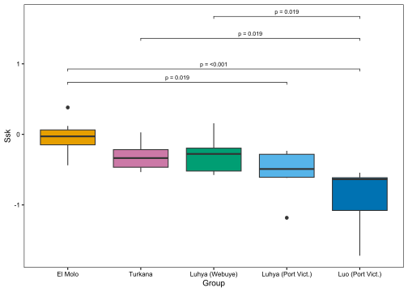<!-- -->

For the *Ssk* variable, we observe that 4 comparisons are significantly different, Interestingly, most comparisons have large or moderate effect sizes, suggesting that the sample size is too low to detect more significant comparisons. The one exception is the negligible effect size in the comparison between the Turkana and Luhya (Webuye).

### Canonical discriminant analysis

Canonical discriminant analyses (CDA) find a linear combination of features that characterizes or separates two or more classes of objects or events. This approach makes important demands in terms of data distribution, and sample sizes. However, alternatives, such as regularized or quadratic discriminant analyses, are more adequate for predictive rather than descriptive analyses[^3]. In addition, even when dealing with non-normal and high dimensional data, CDA axis retain discriminality between classes although cut-off points between classes may be incorrect. In other words, CDA on non-normal data cannot be generalized to other data [@hastie2009, p. 110]. Here, CDA was conducted using the `candisc` function from the `candisc` package, while rLDA was conducted using the `Slda` function from the `HiDimDA` package with the goal of informing the reliability of the CDA approach[^4].

[^3]: **Linear discriminant analysis** (**LDA**), **normal discriminant analysis** (**NDA**), or **discriminant function analysis** is a generalization of **Fisher's linear discriminant**, a method used in statistics and other fields. The terms Fisher's linear discriminant and LDA are often used interchangeably, although Fisher's original article actually describes a slightly different discriminant, which does not make some of the assumptions of LDA such as normally distributed classes or equal class covariances, although [statisticians](https://stats.stackexchange.com/questions/71489/three-versions-of-discriminant-analysis-differences-and-how-to-use-them#:~:text=LDA%20is%20the%20direct%20extension,See%20also.) disagree on the subject. Discriminant analysis (DA) encompasses procedures for classifying observations into groups (predictive discriminant analysis, PDA) and describing the relative importance of variables for distinguishing between groups (descriptive or canonical discriminant analysis, DDA). When following up MANOVA, DA falls into the first [category](https://stats.stackexchange.com/questions/226915/what-is-descriptive-discriminant-analysis). However, discriminant analysis can make substantial demands on sample size. A rule of thumb states that the data should have at least five more observations in each group than the number of variables [@carlson2017, p. 245]. If dealing with high dimensional data, one should instead conduct regularised discriminant analyses (rLDA or RDA) or quadratic discriminant analyses (QDA). [QDA](http://www.sthda.com/english/articles/36-classification-methods-essentials/146-discriminant-analysis-essentials-in-r/) is a variant of LDA in which an individual covariance matrix is estimated for every class of observations, which accommodates more flexible decision boundaries, but whose number of to-estimate parameters increase faster than those of LDA, whereas RDA is a compromise between LDA and QDA that regularizes the individual class covariance matrices, i.e. restrictions are applied to the estimated [parameters](https://yangxiaozhou.github.io/data/2019/10/02/linear-discriminant-analysis.html). However, RDA and QDA do not produce scores, because they partition the space "by ellipsoid like structures based on the estimation of the inner-class covariance [matrices](https://stat.ethz.ch/pipermail/r-help/2013-June/354629.html)". Considering that scores are essential to LDA interpretation following MANOVA, we opted to commit to the simpler LDA.

[^4]: Note that to conduct rLDA we had to standardise the data (by centering and scaling), a different transformation to the rank-transformation used previously.


```r
ISOmanova <- lm(as.matrix(dISO[, 2:12]) ~ Group, dISO)
# summary(manova(ISOmanova), test = 'Wilks')

ISO.can <- candisc(ISOmanova)
ISO.can
```

```
## 
## Canonical Discriminant Analysis for Group:
## 
##    CanRsq Eigenvalue Difference Percent Cumulative
## 1 0.64629    1.82717    0.32596 41.2101     41.210
## 2 0.60019    1.50121    0.32596 33.8584     75.068
## 3 0.45336    0.82935    0.32596 18.7052     93.774
## 4 0.21634    0.27606    0.32596  6.2263    100.000
## 
## Test of H0: The canonical correlations in the 
## current row and all that follow are zero
## 
##   LR test stat approx F numDF denDF  Pr(> F)   
## 1      0.06058  2.11593    44 86.12 0.001524 **
## 2      0.17127  1.87334    30 68.19 0.016817 * 
## 3      0.42838  1.40763    18 48.00 0.171547   
## 4      0.78366  0.86268     8 25.00 0.559555   
## ---
## Signif. codes:  0 '***' 0.001 '**' 0.01 '*' 0.05 '.' 0.1 ' ' 1
```


```r
# Create a data frame for the scores
scores_df <- data.frame(
  Group = ISO.can$scores$Group,
  Can1 = ISO.can$scores$Can1,
  Can2 = ISO.can$scores$Can2
)

# Extract the relevant information from the candisc object
loadings_df <- data.frame(
  Variable = rownames(ISO.can$structure),
  Can1 = ISO.can$structure[, 1],
  Can2 = ISO.can$structure[, 2])

# Calculate the percentage of variance explained by each canonical variable
eigenvalues <- ISO.can$eigenvalues
total_variance <- sum(eigenvalues)
variance_explained <- eigenvalues / total_variance * 100

# Define axis titles including the percentage of variance explained
x_axis_title <- paste("Can1 (", round(variance_explained[1], 1), "%)", sep = "")
y_axis_title <- paste("Can2 (", round(variance_explained[2], 1), "%)", sep = "")

# Calculate centroids for each group
centroids <- aggregate(cbind(Can1, Can2) ~ Group, scores_df, mean)

# Create the biplot using ggplot2
ggplot() +
  geom_point(data = scores_df, aes(x = Can1, y = Can2, color = Group), size = 2) +
  geom_hline(yintercept = 0, linetype = "dashed", color = "gray50") +
  geom_vline(xintercept = 0, linetype = "dashed", color = "gray50") +
  stat_ellipse(data = scores_df, aes(
    x = Can1, y = Can2, fill = Group), 
    geom = "polygon", level = 0.68, alpha = 0.2) +  # Add ellipses for group
  geom_text(data = centroids, aes(
    x = Can1, y = Can2, label = "+"),
    size = 6, color = cbbPalette) +  # Add "+" symbols for centroids
  geom_text_repel(data = loadings_df, aes(
    x = Can1 * 6, y = Can2 * 6, label = Variable),
    size = 3, hjust = 1, vjust = 0.5, box.padding = 0.5) +
  geom_segment(data = loadings_df, aes(x = 0, y = 0,
                                       xend = Can1*5.5, yend = Can2*5.5), 
               arrow = arrow(type = "open", length = unit(0.2, "cm")), 
               linewidth = 0.5, lineend = "round") +
  geom_text(data = centroids, aes(
    x = Can1, y = Can2, label = Group),
    size = 4, color = cbbPalette, fontface = 2,
    nudge_x = c(-1.0, 0.5, -0.5, 1.5, 1.0),
    nudge_y = c(-1.5, -1.2, 1.5, 1.2, -1.0)) +  # Add group labels
  scale_color_manual(values = cbbPalette) +
  scale_fill_manual(values = cbbPalette) +
  coord_fixed(ratio = 1) +
  my_theme + labs(x = x_axis_title, y = y_axis_title) +
  guides(colour = "none", fill = "none")
```

<!-- -->

```r
heplot(ISO.can, var.col = "black", fill = TRUE, fill.alpha = 0.1)
```

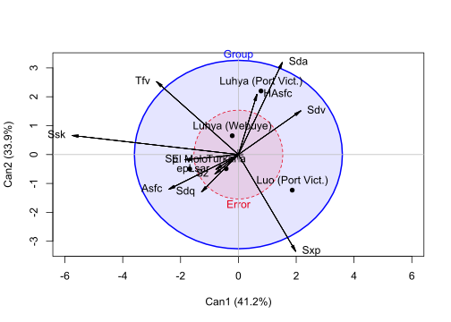<!-- -->

```
## Vector scale factor set to  6.435736
```

```r
plot(ISO.can, which=1, col = cbbPalette, cex.axis = 0.7, cex.lab = 0.9,
     points.1d=TRUE, rev.axes = TRUE,pch = 15:19,
     var.lwd = 2, var.col = "black")
```

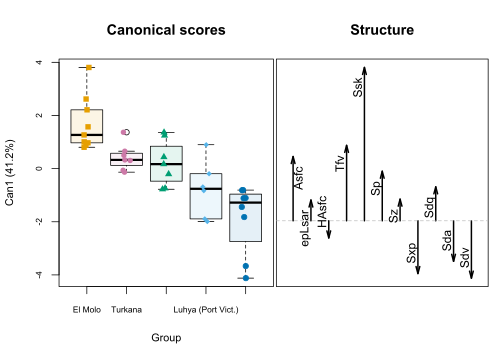<!-- -->

```r
plot(ISO.can, which=2, col = cbbPalette, cex.axis = 0.7, cex.lab = 0.8,
     points.1d=TRUE, rev.axes = TRUE,pch = 15:19,
     var.lwd = 2, var.col = "black")
```

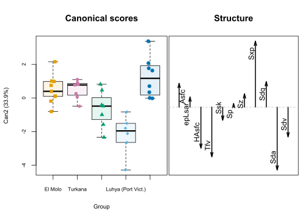<!-- -->


```r
# Create a data frame for the scores
scores_df <- data.frame(
  Group = ISO.can$scores$Group,
  Can3 = ISO.can$scores$Can3,
  Can4 = ISO.can$scores$Can4
)

# Extract the relevant information from the candisc object
loadings_df <- data.frame(
  Variable = rownames(ISO.can$structure),
  Can3 = ISO.can$structure[, 3],
  Can4 = ISO.can$structure[, 4])

# Define axis titles including the percentage of variance explained
x_axis_title <- paste("Can3 (", round(variance_explained[3], 1), "%)", sep = "")
y_axis_title <- paste("Can4 (", round(variance_explained[4], 1), "%)", sep = "")

# Calculate centroids for each group
centroids <- aggregate(cbind(Can3, Can4) ~ Group, scores_df, mean)

# Create the biplot using ggplot2
ggplot() +
  geom_point(data = scores_df, aes(x = Can3, y = Can4, color = Group), size = 2) +
  geom_hline(yintercept = 0, linetype = "dashed", color = "gray50") +
  geom_vline(xintercept = 0, linetype = "dashed", color = "gray50") +
  stat_ellipse(data = scores_df, aes(
    x = Can3, y = Can4, fill = Group), 
    geom = "polygon", level = 0.68, alpha = 0.2) +  # Add ellipses for group
  geom_text(data = centroids, aes(
    x = Can3, y = Can4, label = "+"),
    size = 6, color = cbbPalette) +  # Add "+" symbols for centroids
  geom_text_repel(data = loadings_df, aes(
    x = Can3 * 6, y = Can4 * 6, label = Variable),
    size = 3, hjust = 1, vjust = 0.5, box.padding = 0.5) +
  geom_segment(data = loadings_df, aes(x = 0, y = 0,
                                       xend = Can3*5.5, yend = Can4*5.5), 
               arrow = arrow(type = "open", length = unit(0.2, "cm")), 
               linewidth = 0.5, lineend = "round") +
  geom_text(data = centroids, aes(
    x = Can3, y = Can4, label = Group),
    size = 4, color = cbbPalette, fontface = 2,
    nudge_x = c(1.0, -0.5, 0.0, -1.0, 1.5),
    nudge_y = c(1.5, -1.0, -1.0, 1.2, -0.5)) +  # Add group labels
  scale_color_manual(values = cbbPalette) +
  scale_fill_manual(values = cbbPalette) +
  coord_fixed(ratio = 1) +
  my_theme + labs(x = x_axis_title, y = y_axis_title) +
  guides(colour = "none", fill = "none")
```

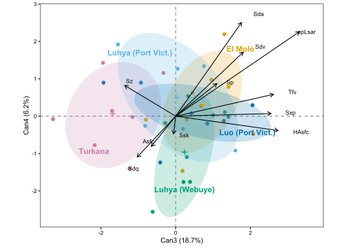<!-- -->

```r
heplots::heplot(ISO.can, variables = 3:4, var.col = "black",
       fill = TRUE, fill.alpha = 0.1)
```

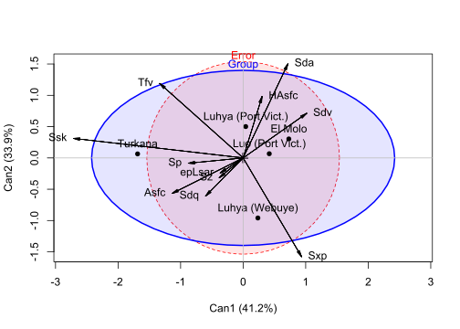<!-- -->

```
## Vector scale factor set to  3.034421
```

The CDA finds 4 canonical vectors, but only two have group means that are significantly different. Together, the 2 explain 75% of the variation observed.

The **HE plot** represent sums-of-squares-and-products matrices for linear hypotheses (**H**) and for error (**E**). In the default scaling, such plots have the visual property that a given effect in the multivariate linear model is significant (by Roy's maximum root test) if the H ellipse projects anywhere outside the E ellipse. The size of the H ellipse relative to that of the E ellipse is an indication of the magnitude of the multivariate effect for group. The further away variable centroids are from the "Error" circle, the stronger the association between groups and variables [@friendly2017].

In the **biplot**, each data point is represented by its score on the discriminant axis. The variable vectors represent the structure coefficients, i.e. the angle between the vector and the canonical axis represent the correlation of variables with canonical scores, while the vector's relative length reflect the sum of the squared correlations and hence represent the variable's contribution to the discrimination between groups [@field2012, p. 738].


```r
scaled_ISO <- dISO |>
    mutate(across(where(is.numeric), scale))

Slda <- Slda(data = as.matrix(scaled_ISO[, 2:12]), grouping = scaled_ISO$Group,
    StddzData = TRUE, ladfun = "classification")
Slda
```

```
## Call:
## Slda.default(data = as.matrix(scaled_ISO[, 2:12]), grouping = scaled_ISO$Group, 
##     StddzData = TRUE, ladfun = "classification")
## 
## Prior probabilities of groups:
##            El Molo            Turkana     Luhya (Webuye) Luhya (Port Vict.) 
##          0.2432432          0.1891892          0.1891892          0.1621622 
##   Luo (Port Vict.) 
##          0.2162162 
## 
## Group means:
##                           Tfv        Ssk        Sxp          Sda
## El Molo             0.6393859  0.8847521  0.1170062 -0.102954091
## Turkana            -0.6359069  0.2133864 -0.5262379 -0.623304691
## Luhya (Webuye)      0.2228006  0.2406359 -0.1939716 -0.166426744
## Luhya (Port Vict.)  0.4264057 -0.3306241 -0.5939760  1.073557817
## Luo (Port Vict.)   -0.6776453 -1.1446475  0.9440333  0.001669996
## 
## Coefficients of linear discriminants:
##             LD1        LD2        LD3        LD4
## Tfv -0.39348495 -0.4456465 0.65633995  0.8074253
## Ssk -1.22926872  0.1839274 0.04278755 -0.7178051
## Sxp -0.04260694  0.8299720 0.81804596 -0.2981733
## Sda  0.53782314 -0.7345409 0.17354765 -0.7349617
## Proportion of trace:
##         LD1         LD2         LD3         LD4 
## 0.554380573 0.317499098 0.123729033 0.004391297 
## 
## Variables kept in discriminant rule:
## [1] "Tfv" "Ssk" "Sxp" "Sda"
## Number of variables kept: 4
```

'Slda' is a shrunken discriminant analysis that finds the coefficients of a linear discriminant rule based on Fisher and Sun's (2011) estimate and generalizations of Ledoit and Wolf's (2004) optimal shrunken covariance matrix [@silva2015]. Here, it finds 4 discriminants just as the canonical approach, and keeps 4 variables in the discriminant rule, *Tfv*, *Ssk*, *Sxp*, *Sda*, which are also the variables with higher impact before. Thus, this approach confirms the discriminatory and descriptive power of the canonical approach. As scores are not produced in these approaches, no further analyses is possible.

# References

::: {#refs}
:::


```
## R version 4.3.1 (2023-06-16 ucrt)
## Platform: x86_64-w64-mingw32/x64 (64-bit)
## Running under: Windows 10 x64 (build 19045)
## 
## Matrix products: default
## 
## 
## locale:
## [1] LC_COLLATE=English_United Kingdom.utf8 
## [2] LC_CTYPE=English_United Kingdom.utf8   
## [3] LC_MONETARY=English_United Kingdom.utf8
## [4] LC_NUMERIC=C                           
## [5] LC_TIME=English_United Kingdom.utf8    
## 
## time zone: Europe/Lisbon
## tzcode source: internal
## 
## attached base packages:
## [1] stats     graphics  grDevices utils     datasets  methods   base     
## 
## other attached packages:
##  [1] RVAideMemoire_0.9-83-7 vegan_2.6-4            lattice_0.21-8        
##  [4] permute_0.9-7          HiDimDA_0.2-4          ggpubr_0.6.0          
##  [7] lemon_0.4.7            formatR_1.14           kableExtra_1.3.4.9000 
## [10] candisc_0.8-6          heplots_1.6.0          broom_1.0.5           
## [13] rstatix_0.7.2          rrcov_1.7-4            robustbase_0.99-1     
## [16] mvnormtest_0.1-9       mvoutlier_2.1.1        sgeostat_1.0-27       
## [19] car_3.1-2              carData_3.0-5          corrplot_0.92         
## [22] ggspatial_1.1.9        ggrepel_0.9.4          gt_0.10.0             
## [25] rnaturalearth_1.0.1    lubridate_1.9.3        forcats_1.0.0         
## [28] stringr_1.5.1          dplyr_1.1.3            purrr_1.0.2           
## [31] readr_2.1.4            tidyr_1.3.0            tibble_3.2.1          
## [34] ggplot2_3.4.4          tidyverse_2.0.0       
## 
## loaded via a namespace (and not attached):
##  [1] rstudioapi_0.15.0       jsonlite_1.8.8          datawizard_0.9.1       
##  [4] magrittr_2.0.3          TH.data_1.1-2           estimability_1.4.1     
##  [7] farver_2.1.1            rmarkdown_2.25          vctrs_0.6.4            
## [10] base64enc_0.1-3         terra_1.7-65            effectsize_0.8.6       
## [13] webshot_0.5.5           htmltools_0.5.7         sass_0.4.8             
## [16] KernSmooth_2.23-21      bslib_0.6.1             htmlwidgets_1.6.4      
## [19] plyr_1.8.9              sandwich_3.1-0          emmeans_1.9.0          
## [22] zoo_1.8-12              cachem_1.0.8            lifecycle_1.0.4        
## [25] pkgconfig_2.0.3         Matrix_1.6-4            R6_2.5.1               
## [28] fastmap_1.1.1           digest_0.6.33           colorspace_2.1-0       
## [31] labeling_0.4.3          fansi_1.0.5             timechange_0.2.0       
## [34] httr_1.4.7              abind_1.4-5             mgcv_1.8-42            
## [37] compiler_4.3.1          proxy_0.4-27            withr_2.5.2            
## [40] backports_1.4.1         DBI_1.2.0               highr_0.10             
## [43] ggsignif_0.6.4          MASS_7.3-60             classInt_0.4-10        
## [46] tools_4.3.1             units_0.8-4             glue_1.6.2             
## [49] rnaturalearthdata_0.1.0 nlme_3.1-162            grid_4.3.1             
## [52] sf_1.0-14               cluster_2.1.4           generics_0.1.3         
## [55] gtable_0.3.4            tzdb_0.4.0              class_7.3-22           
## [58] hms_1.1.3               sp_2.1-2                xml2_1.3.6             
## [61] utf8_1.2.4              pillar_1.9.0            splines_4.3.1          
## [64] survival_3.5-5          tidyselect_1.2.0        knitr_1.45             
## [67] gridExtra_2.3           svglite_2.1.3           stats4_4.3.1           
## [70] xfun_0.41               DEoptimR_1.1-3          stringi_1.8.3          
## [73] yaml_2.3.8              evaluate_0.23           codetools_0.2-19       
## [76] cli_3.6.1               xtable_1.8-4            parameters_0.21.3      
## [79] systemfonts_1.0.5       munsell_0.5.0           jquerylib_0.1.4        
## [82] Rcpp_1.0.11             parallel_4.3.1          rgl_1.2.8              
## [85] bayestestR_0.13.1       viridisLite_0.4.2       mvtnorm_1.2-4          
## [88] scales_1.3.0            e1071_1.7-13            pcaPP_2.0-4            
## [91] insight_0.19.7          rlang_1.1.1             rvest_1.0.3            
## [94] multcomp_1.4-25
```
