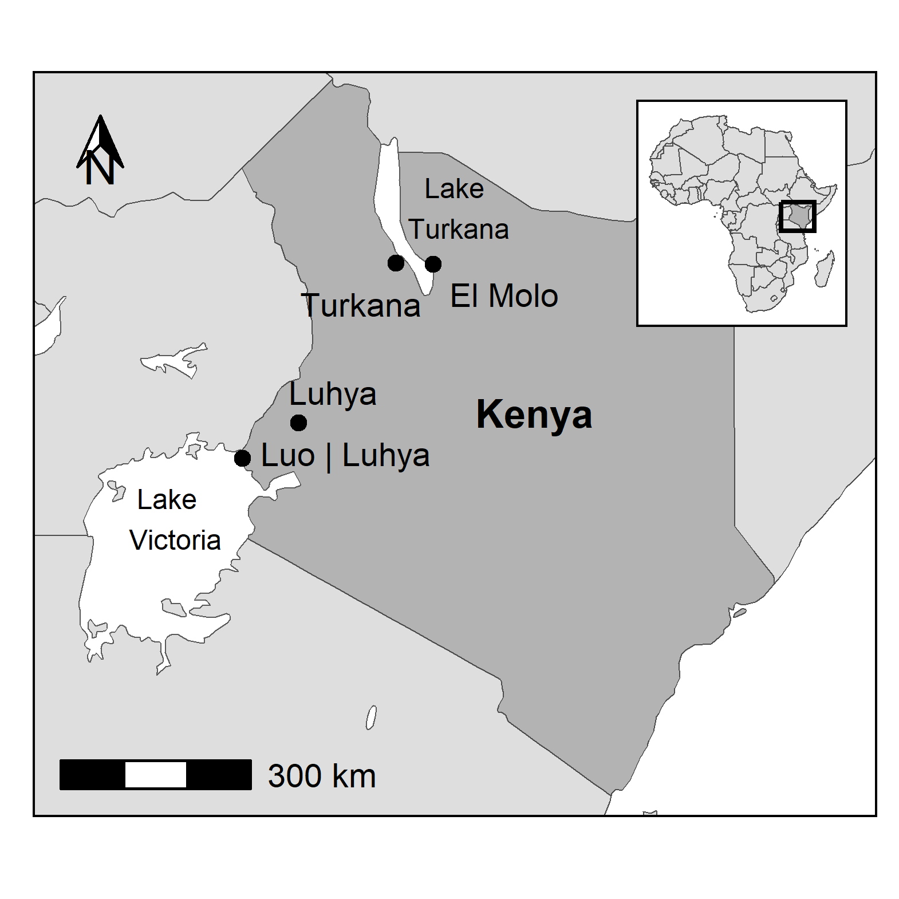
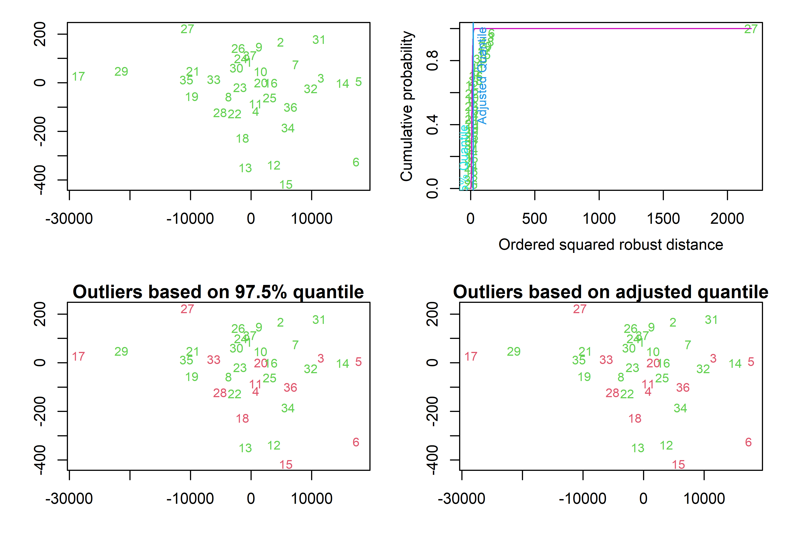
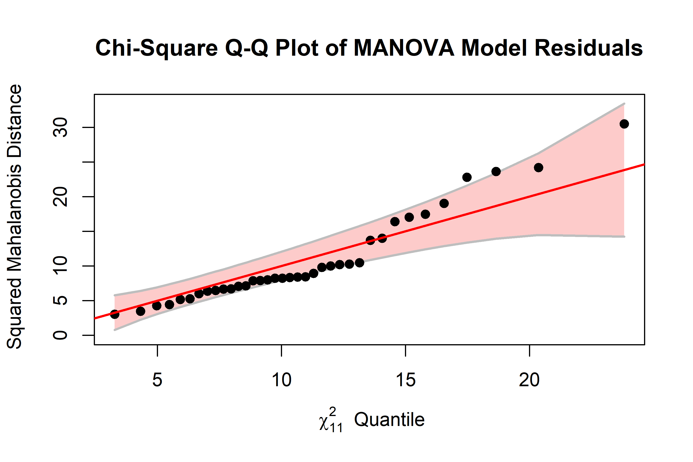
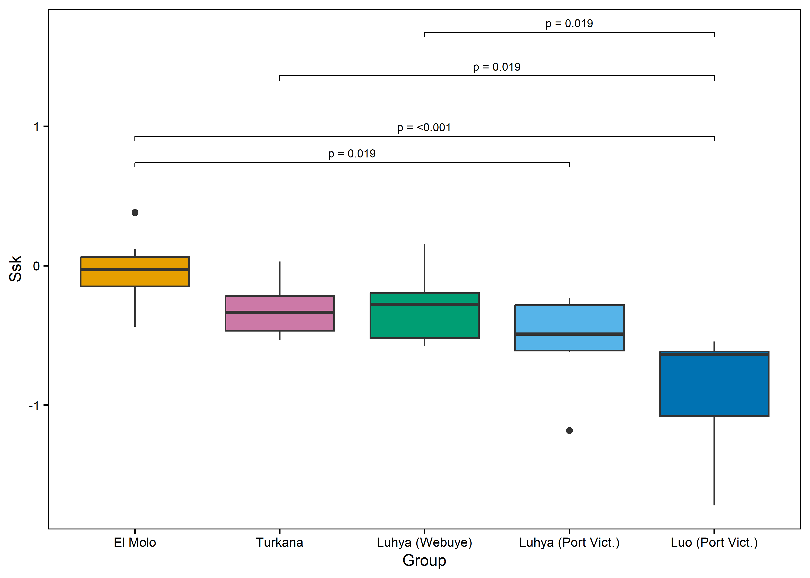
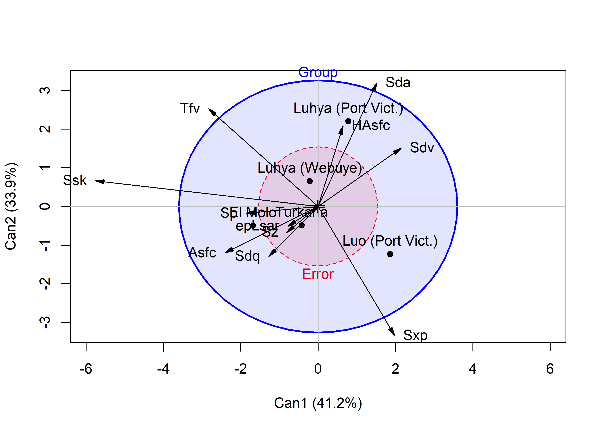
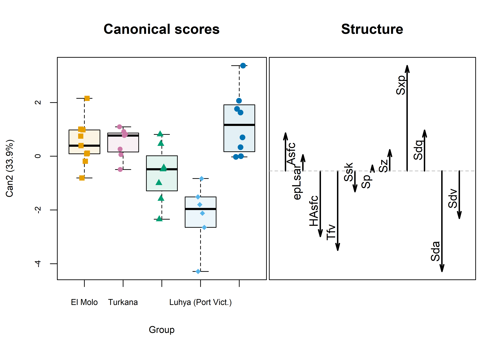

---
output:
  html_document:
    keep_md: TRUE
---

* map-1.png 
 * matrix-1.png 
 * summary-1.png 
 * multi outliers-1.png 
 * multi normality-1.png 
 * followup pairwise-1.png 
 * LD1LD2-1.png 
 * LD1LD2-2.png 
 * LD1LD2-3.png 
 * LD1LD2-4.png 
 * LD3LD4-1.png 
 * LD3LD4-2.png 
